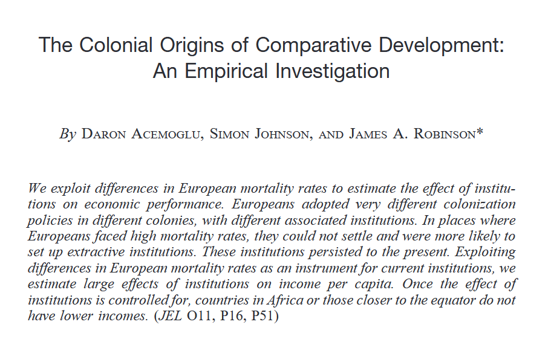
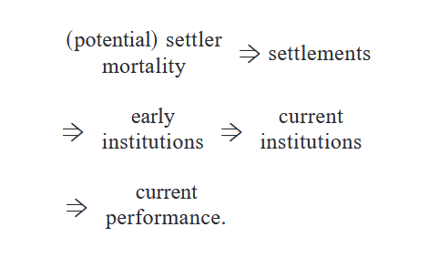
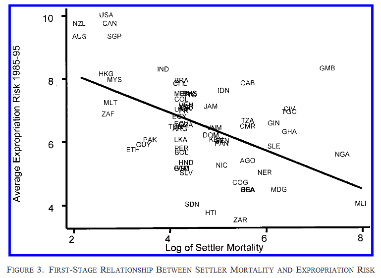
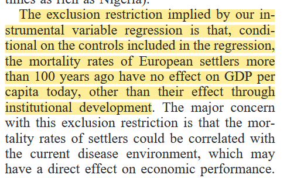

# Review of causality concepts {.section}

## Review of concepts

- What do we mean by "counterfactual"?
- What is the "Fundamental problem of causal inference"?
- What do we mean when we say that a certain "treatment" is "exogenous" or "endogenous"?
- What do we mean by "selection problem"?
- What does it mean that a regression estimate of a causal effect is "biased"?

## Class activity {.center}

::: {.r-fit-text}
People make causal claims at each moment of daily life. Consider the following claims, which you may hear or read on the streets or in the media. We will evaluate each claim with the analytical mindset of the social scientist. That is, we will try to "break them down" into their logical components and evaluate if they are sound.
::: 


## Class activity

Work with your neighbors. For each of the provided causal claim, think of and provide the following information:

- **Units**: Who or what is studied? 
- **Treatment**: What is the implied intervention or cause?
- **Outcome**: What is the affected quantity that is considered?
- **The Comparison**: What are the implicit "treated" and "control" units compared?
- **Threats to Identification**: Is the simple comparison appropriate or not? If not, why?
- **Assumptions**: What must be true for us to claim the treatment caused the outcome?
- **Research design**: What could an appropriate research design to test this claim with real world data?

. . . 

::: {.panel-tabset}

### Example 1

>"I was passing near the city hospital the other day and I saw some of the dismissed patients walk out. Some of them looked in really bad shape compared to me and other people I saw that day. I wonder if the hospital has any benefit at all."
>
> — Random person on the street

### Example 2

> "We added one lane to the Bologna-Milano highway but it's always congested, while the highway connecting Bergamo and Brescia has just 2 lanes but is always free. Clear evidence that the new lane was not a good use of taxpayer's money!"
> 
> — Italian Member of Parliament

### Example 3

> "Foreign aid doesn't work! I've been looking at the data from 1960 to 2000, and guess what? The countries that got the most aid money are exactly the ones with the worst economic growth. We're just throwing money down the drain!"
> 
> — Concerned policy analyst

### Example 4

> "Economic sanctions are completely useless! I analyzed all the sanctions imposed in the 20th century, and in 95% of the cases, the dictator just stayed in power. It's clear evidence that sanctions don't work at all."
> 
> — International relations expert

### Example 5

> "Oil kills democracy! Just look at any world map - all the Gulf countries are swimming in oil and they're all authoritarian. Meanwhile, Japan and Switzerland have basically no natural resources and they're perfectly democratic. The pattern is crystal clear!"
> 
> — Political commentator

:::


# Review of instrumental variables {.section}

## Instrumental variables

```{r}
#| echo: false
#| fig-width: 6
#| fig-height: 3
#| out-height: "400px"    
#| out-width: "auto"      
#| 
library(ggdag)
library(ggplot2)

# Create an IV DAG
dag_iv <- dagify(
  y ~ D + C,
  D ~ Z + C,
  coords = list(x = c(Z = 1, C = 2.5, D = 2, y = 4),
                y = c(Z = 2, C = 3, D = 1, y = 1))
)

ggdag(dag_iv) +
  theme_dag_blank() +
  labs(title = "Instrumental Variables: Z causes D, D causes Y, but Z does not directly cause Y") +
  theme(plot.title = element_text(hjust = 0.5, size = 12))
```

. . . 

Recall the main identification assumptions of the IV design

- The instrument is random (or random after controlling for covariates)
- The instrument has an effect on the treatment
- The instrument has an effect on the outcome <u>only through the treatment</u>. This is called the [Exclusion restriction]{.alert}

## Instrumental variables

```{r}
#| echo: false
#| fig-width: 6
#| fig-height: 3
#| out-height: "400px"    
#| out-width: "auto"      
#| 
library(ggdag)
library(ggplot2)

# Create an IV DAG
dag_iv <- dagify(
  y ~ D + C,
  D ~ Z + C,
  coords = list(x = c(Z = 1, C = 2.5, D = 2, y = 4),
                y = c(Z = 2, C = 3, D = 1, y = 1))
)

ggdag(dag_iv) +
  theme_dag_blank() +
  labs(title = "Instrumental Variables: Z causes D, D causes Y, but Z does not directly cause Y") +
  theme(plot.title = element_text(hjust = 0.5, size = 12))
```


**Exercise**: how plausible are these assumptions in each of these cases? Can you think of a better instrument?


::: {.panel-tabset}

### Example 1

| Research Question | Treatment | Instrument | Outcome |
|-------------------|-----------|------------|---------|
| Does social pressure increase turnout? | Reading an appeal to vote | Randomized postcard with an appeal | Individual turnout |

### Example 2

| Research Question | Treatment | Instrument | Outcome |
|-------------------|-----------|------------|---------|
| Does education improve earnings? | Years of schooling | Quarter of birth | Annual income |

### Example 3

| Research Question | Treatment | Instrument | Outcome |
|-------------------|-----------|------------|---------|
| Do trade policies affect growth? | Free trade agreement | Geographic proximity | GDP per capita |

### Example 4

| Research Question | Treatment | Instrument | Outcome |
|-------------------|-----------|------------|---------|
| Does economic growth reduce civil conflict? | GDP per capita growth | Rainfall variation | Civil conflict incidence |

:::


# Application: Acemoglu, Johnson, Robinson (2001)

## A Nobel-winning research agenda



## AJR highlights

::::{.columns .center}
::: {.column width="60%"}
- What is the research question in the paper?
- What is the "treatment"? What is the outcome? What is the instrument?
- What is the exclusion restriction?

:::
::: {.column width="40%"}

:::
::::

## First stage

{width="60%"}

What is the "first stage" in their design?

## Exclusion restriction

{width="60%"}

- Do you think the exclusion restriction is plausible?
- What does it imply?