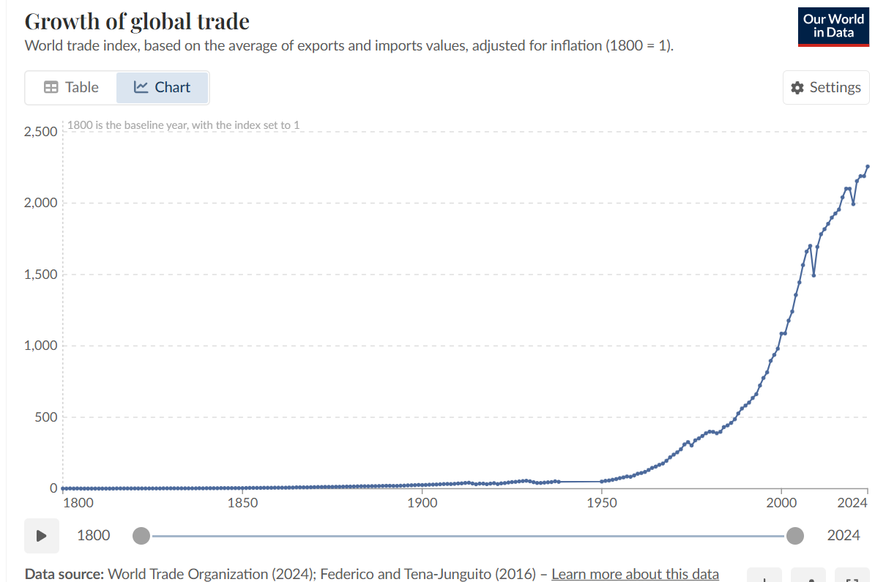
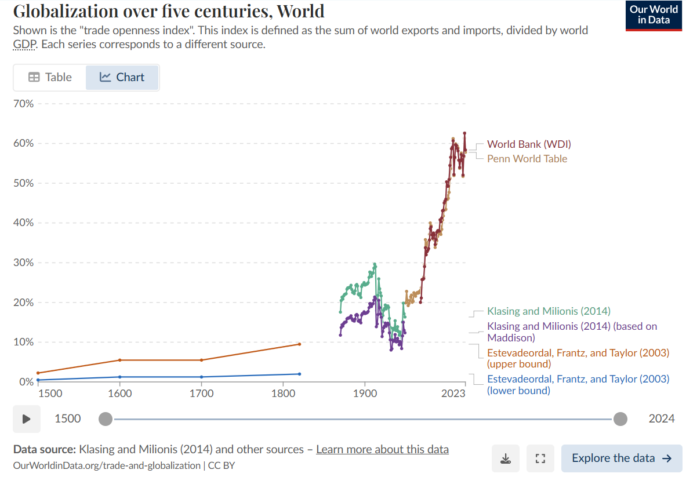
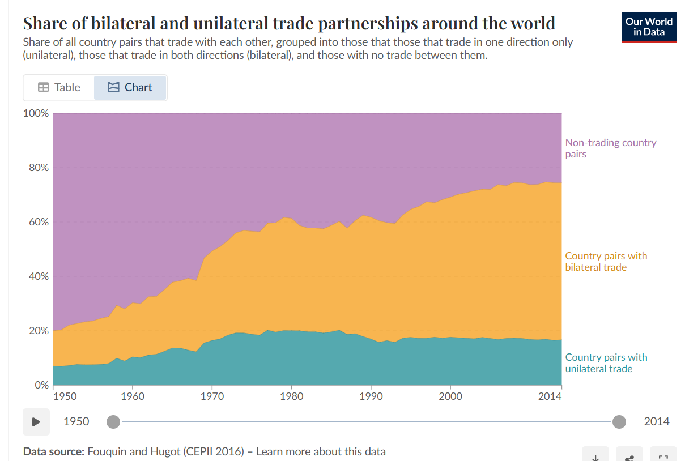
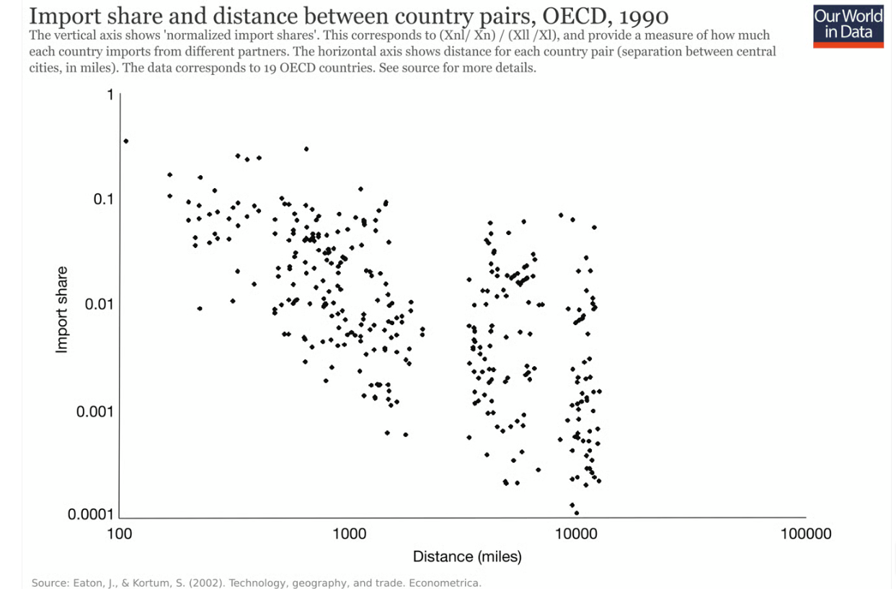
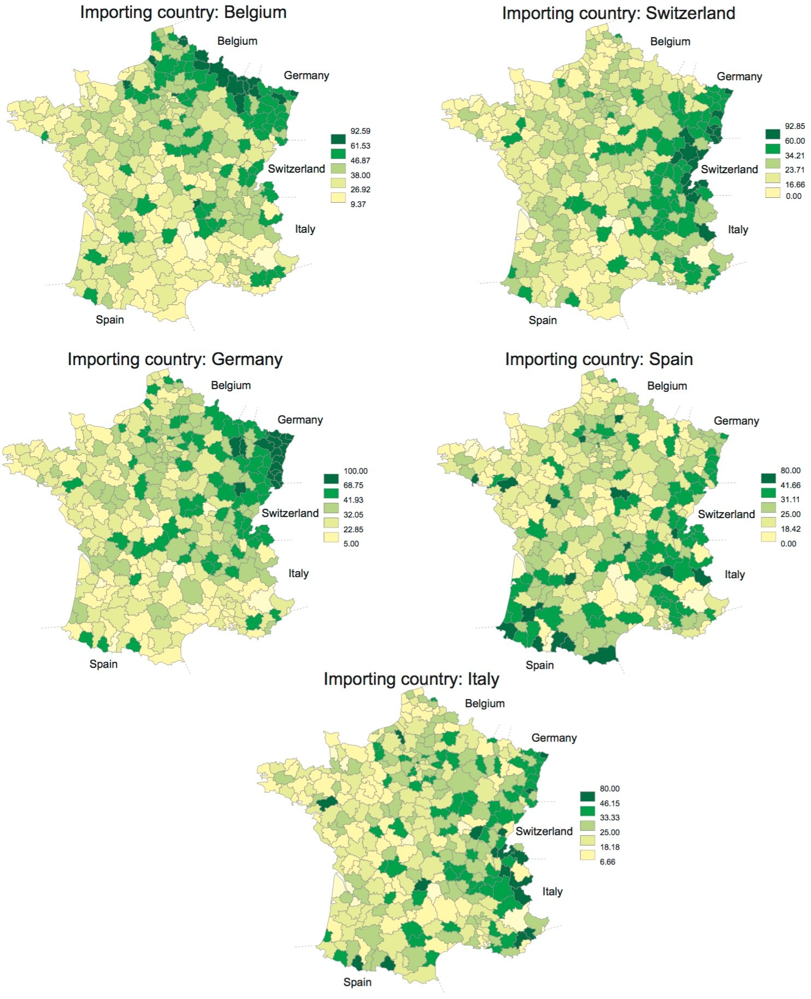
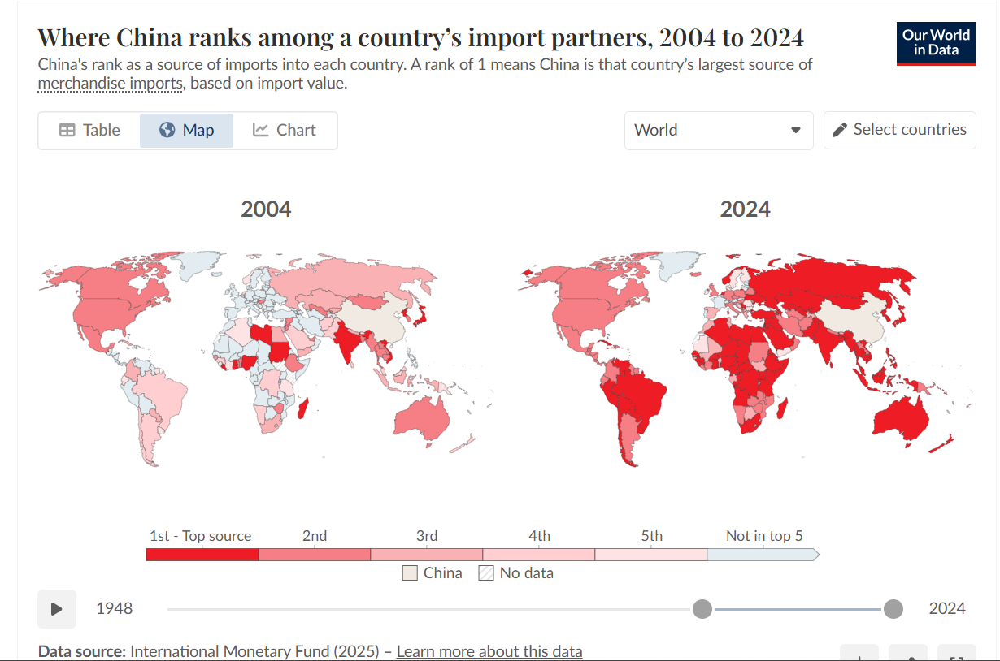
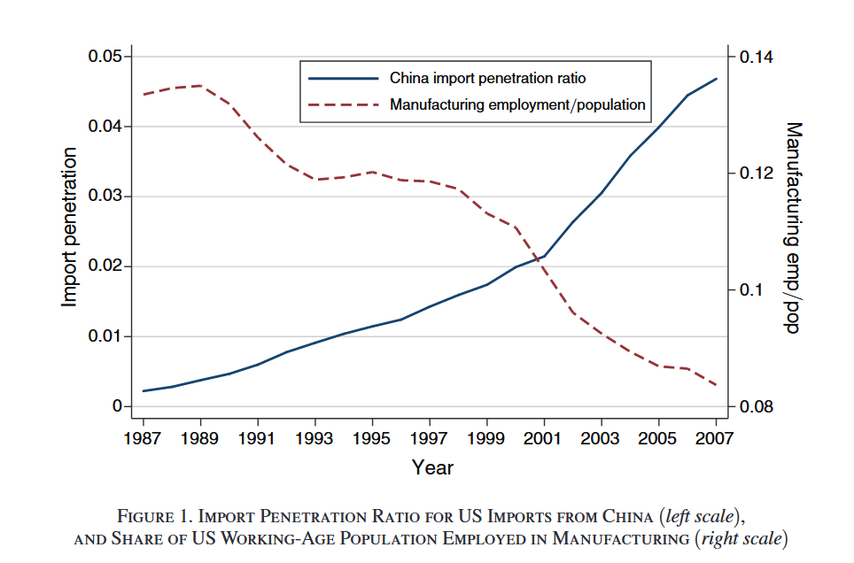
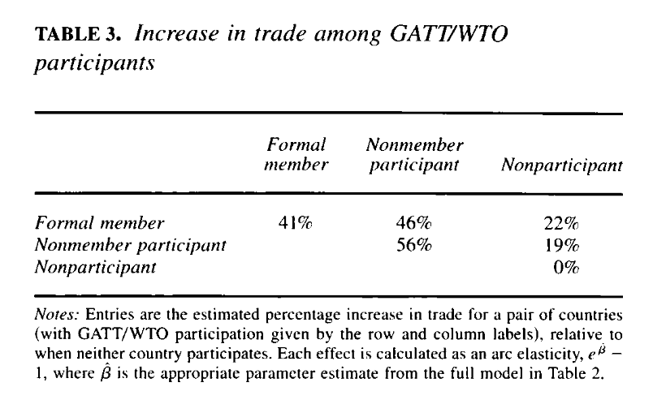
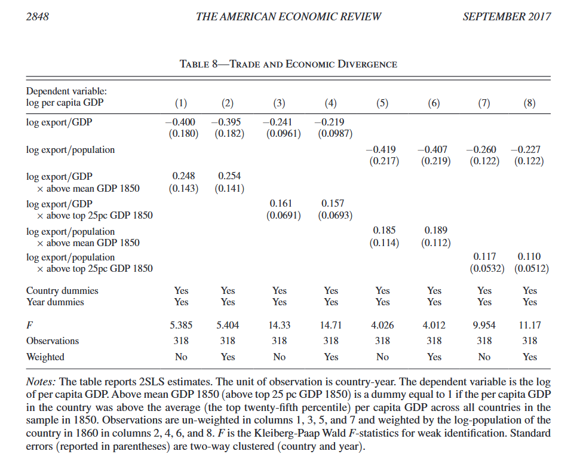
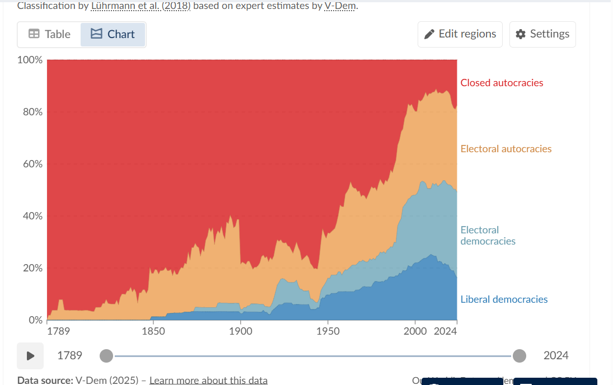

## Today

- Globalization and trade integration
- Institutions for free trade: GATT/WTO
- Did institutions increase trade flows?
- What are the consequences of trade integration (economic and political)?

# Globalization {.section}

## What is globalization?

What do you think of when you think of "globalization"?

. . . 

> Globalization is the process of increasing interdependence and integration among the economies, markets, societies, and cultures of different countries worldwide. This is made possible by the reduction of barriers to international trade, the liberalization of capital movements, the development of transportation, and the advancement of information and communication technologies
>
> [Wikipedia](https://en.wikipedia.org/wiki/Globalization)

. . . 

It is a complex phenomenon which involves the exchange of goods, services, information, technology, and people

. . . 

Many of these components have a dedicated module

In this module, we will focus on the [trade]{.alert} component of globalization

# Globalization and Trade {.section}

## Globalization and trade

Source: [Our World in Data](https://ourworldindata.org/trade-and-globalization)

## Globalization and trade

## Globalization and trade

## Geography and trade

## Geography and trade

## Geography and trade

Not just physical geography, but how "fast to reach" a country is

[Pascali (2017)](https://pubs.aeaweb.org/doi/pdfplus/10.1257/aer.20140832) shows that the first wave of globalization (1870-1913) was facilitated by the introduction of steam engines

They drastically reduced shipping times for merchant ships, which previously could only rely on wind

. . . 

Studies that try to do causal inference on trade use some exogenous factor (related to geography) that reduces trade costs between two countries

For instance: distance, or changes in travel times as determined by changes in transport technology

## Globalization and trade

**Class activity**

- Work in pairs with your neighbor
- Go to [https://ourworldindata.org/trade-and-globalization#trade-partnerships](https://ourworldindata.org/trade-and-globalization#trade-partnerships)
- Look at the plots in this section and answer: How did the flows of trade between rich and poor countries change over time since the early 1800s?
- What could explain these patterns?

## The rise of China in the world economy

## The rise of China in the world economy

**Class activity**

- Work in pairs with your neighbor
- Go to [https://ourworldindata.org/trade-and-globalization#trade-partnerships](https://ourworldindata.org/trade-and-globalization#trade-partnerships)
- Look at the plots in this section and answer: How did the share of imports from China evolve over time for the US and Europe?

## The rise of China in the world economy

Source: Autor, Dorn, Hanson (2013)

# Institutions for Free Trade: GATT/WTO {.section}

## GATT and WTO

**General Agreement on Tariffs and Trade (1947)**

- Multilateral treaty to elimitate barriers to trade among countries

- Forum for discussion and legal framework for regulating trade

- [Most Favored Nation]{.alert} principle: country A cannot be treated less favorably by country B than the "most favored nation" of country B 

- Bilateral concessions apply to all other countries $\implies$ non-discrimination

. . . 

**World Trade Organization (1995)**

- Extends GATT to services and intellectual property

. . . 

**Theoretically** speaking, can we expect these institutions to improve international trade? Why?

[hint: recall the discussion in session 2. Is trade policy a social dilemma?]

## Did the GATT/WTO increase free trade?

Goldstein, Rivers, and Tomz (2007) study the effects of GATT/WTO on trade between countries

. . . 

Recap of the study:

- What is the motivation for their study? Is there a gap or puzzle they want to address?
- What is their argument regarding the effect of GATT/WTO?
- What is their research design (units of analysis, methods=?

## Did the GATT/WTO increase free trade?

## Did the GATT/WTO increase free trade?

Do you think this study has broader implications for studying the effects of institutions?

# The Effects of Trade {.section}

## Economic effects of trade

What do you think are the effects of trade on:

- Growth?
- Inequality?

## Economic effects of trade

## Trade and democracy

Source: [Our World in Data](https://ourworldindata.org/democracy) and [V-Dem](https://www.v-dem.net/)

## Does trade integration lead to the spread of democracy?

Tabellini and Magistretti (2025) study this question

- What is their research question?
- What are the elements of their research design? What is the "treatment"? What is the "instrument"?
- What are the **mechanisms** that they suggest for the result and the ones they say they rule out?
- Intuitively, what are the identification assumptions? Are they plausible?

. . . 

Can you think of negative consequences of the globalization (trade integration) on democracy?

## Next

- Understanding reactions to globalization: winners and losers
- The backlash against globalization today
- The rise of the radical right in Western democracies

