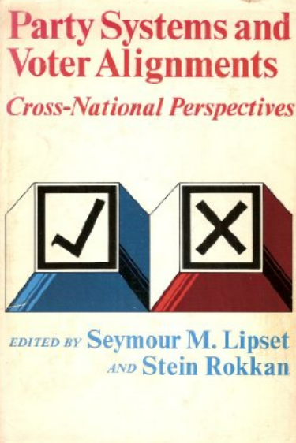
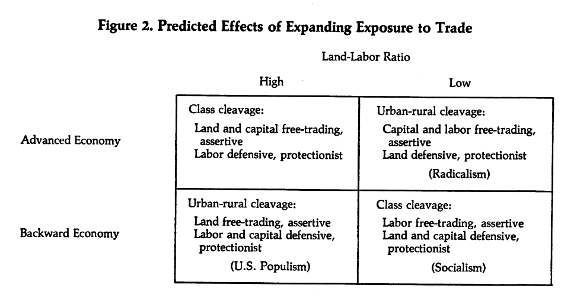
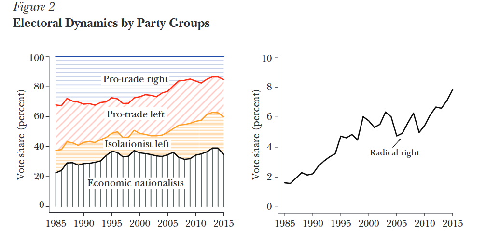
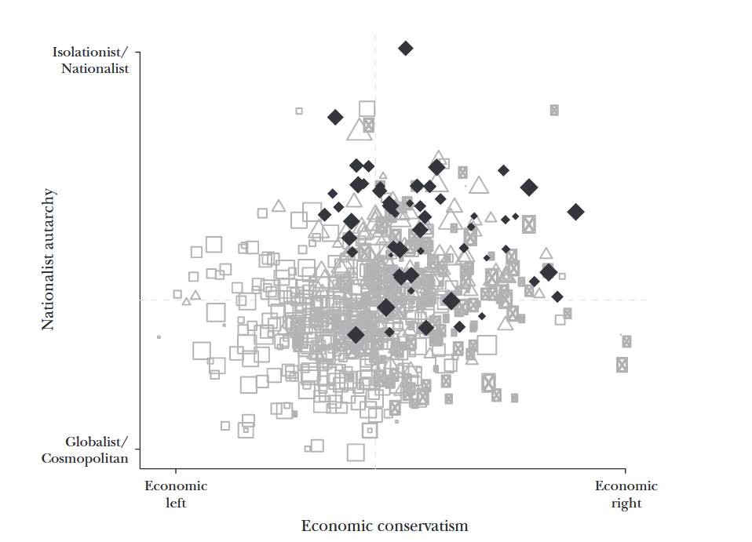
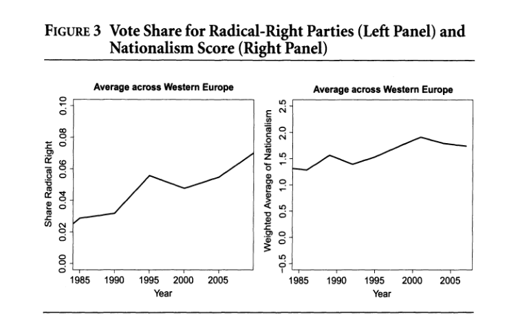
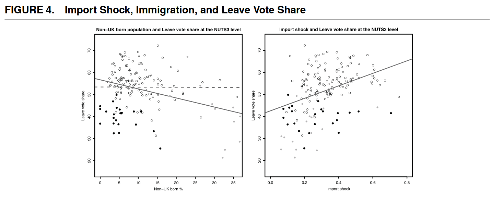

## Today

- Understanding reactions to globalization: winners and losers
- Backlash against globalization 
- Backlash today: the rise of the radical right in Western democracies


# Trade and domestic politics {.section}

## From international to domestic politics

::::{.columns}
::: {.column width="50%"}

- So far, we have considered trade and globalization as relations between states

- But states are not abstract entities: they are run by governments elected by people (voters)

- Politicians are representatives of diverse and legitimate interests in society 

- Different groups have different interests over economic policy, including trade policy

- Elections are the main institutional solution to organize political conflict between conflicting interests

:::
::: {.column width="50%"}

```{r}
#| engine: tikz
#| echo: false
#| fig-align: center
#| fig-ext: svg

\begin{tikzpicture}[
    node distance=4.5cm,  % <--- Increased distance to make arrows longer
    % --- Styles ---
    levelbox/.style={
        rectangle,
        draw=black!60,
        fill=blue!10,
        rounded corners=5pt,
        minimum width=7cm,
        minimum height=1.5cm,
        align=center,
        font=\sffamily\bfseries\large
    },
    upstream/.style={
        ->, >=stealth,
        line width=2pt,
        color=black!70
    },
    downstream/.style={
        ->, >=stealth,
        line width=1.5pt,
        color=red!70,
        dashed
    },
    % New style for the labels on the arrows
    arrowlabel/.style={
        midway,
        fill=white,         % Hides the arrow line behind the text
        align=center,
        font=\small\sffamily,
        text width=4cm,     % Forces text to wrap if its too long
        text=black!80
    }
]

    % --- Nodes ---
    \node[levelbox] (intl) {Relations between States};
    \node[levelbox, below of=intl] (pol) {Elected Politicians};
    \node[levelbox, below of=pol] (voters) {Voters and Society};

    % --- Arrows ---
    
    % Upstream 1: Voters -> Politicians
    \draw[upstream] (voters.north) -- node[arrowlabel] {Voters elect / keep politicians accountable} (pol.south);
    
    % Upstream 2: Politicians -> International
    \draw[upstream] (pol.north) -- node[arrowlabel] {Politicians decide on relations} (intl.south);

    % --- Downstream (Feedback) ---
    
    % Politicians -> Voters (Right side)
    \draw[downstream] (pol.east) to[out=0, in=0, looseness=1.5] node[midway, right, font=\footnotesize, text=black] {Policy Impact} (voters.east);

    % International -> Voters (Left side)
    \draw[downstream] (intl.west) to[out=180, in=180, looseness=1.2] node[midway, left, font=\footnotesize, text=black] {Shocks} (voters.west);

\end{tikzpicture}
```
:::
::::


## Trade and political conflict

Almost every government policy generates costs and benefits for some groups in society: "winners" and "losers"

Trade is no exception: some social groups mostly benefit from it while others bear the cost

This is different from saying that the *net effect* for society is positive or negative: it just means that the costs and/or benefits are unequally distributed

. . . 

We need to ask: 

- What groups are likely to benefit or lose from trade?
- What can they do to advance their interests domestically?
- How does the political conflict evolve over time?


## Political cleavages

An influential framework to think of political conflict is that of [cleavages]{.alert}

. . . 

::: {.callout-note title="Definition: political cleavages"}
A cleavage is a social division between groups of citizens with different political interests
:::

. . . 

::::{.columns}
::: {.column width="60%"}
Originates from the seminal work of political scientists S.M. Lipset and S. Rokkan 

- The [politicization]{.alert} of social cleavages tends to coordinate voting behavior and create voter blocs
- Durable cleavages structure party systems (e.g., in early 20$^{th}$ century Europe)
- The most salient ones in history: Capital vs Labor, Secularism vs Religion, Center vs Periphery, Urban vs Rural
- Social-economic changes can alter the nature of cleavages and the parties that express them

:::
::: {.column width="40%"}

:::
::::

## Exposure to trade and political cleavages: Rogowski (1987)

Foundations of Rogowski's argument:

**International Economics theory**

- International trade leads to country specialization in the products of which the country has larger endowments $\rightarrow$ a land-abundant and capital-scarce country exports agricultural products (land-intensive) and imports cars (labor-intensive)

- Trade liberalization increases the economic returns from the good of which a country is more abundant

. . . 

**Political Economy**

- Economic factors (land, labor, capital) are associated with social groups possessing them $\rightarrow$ landowners, laborers, capitalists

- Groups whose *economic* power increases seek to increase their *political* power over policy

. . . 

[*Any* factor that increases/reduces exposure to trade induces these dynamics $\rightarrow$ a technological improvement that makes transport cheaper is functionally equivalent to a tariff reduction]{.remark}

. . . 

$\implies$ exposure to trade activates a political cleavage between winners and losers from trade


## Trade liberalization and cleavage structure




## Implications of the theory

To summarize:

- Increasing exposure to trade generates political conflict between winners and losers
- Political parties representing these interests can compete electorally with liberalization/protectionist platforms
- We can expect changes in trade policy as balance of political power between groups shift over time

. . . 

However, we have noticed a few facts:

- International integration and international trade have steadily increased in the last 80 years
- Integration requires coordination and predictability of trade policies between countries
- International institutions favor trade exactly by making integration difficult to revert

. . . 

How do we reconcile domestic conflict over trade with the steady integration of the post-war period?

## Historical compromise: an "embedded liberalism" 

The solution adopted in much of the West was "embedded liberalism" (Ruggie 1982): an implicit social contract between the main parties and social groups

- Increasing moves towards market liberalization and international integration in the post-war system
    - In Europe: gradual transition to a European Union 
    - At international level: GATT/WTO and other institutions

- Sustained growth for the countries involved
- Social policies and expansion of the "welfare state" to protect the losers and contain inequality


## The break-up of the compromise?

As globalization deepens and economic systems transform, "embedded liberal" compromise comes under pressure

- The entry of new players in the international system leads to structural changes in local economies, with highly localized costs $\rightarrow$ some local industries are permanently dismissed
- International integration leads to delocalization in poorer countries and labor migration to richer countries
- Capital mobility makes difficult to raise taxes on wealth and compensate losers
- "Inertia" of traditional parties in light of these problems reduces their perceived credibility and representativeness

. . . 

$\implies$ old and new cleavages activated and "new" parties emerge 


# Backlash against globalization {.section}

## The radical right 

:::: {.columns}

::: {.column width="33%"}
.jpg)
:::

::: {.column width="33%"}
.webp)
:::

::: {.column width="33%"}

:::

::::


. . . 

What is the radical right? (see Colantone and Stanig 2019)

- Critical of liberal democracy and institutional checks on the will of the majority
- Exclusionary nationalism and nativism
- Populism: rejection of pluralism and elitism in favor of "people vs elites" conception of politics

## The rise of the radical right in the Western world

The success of the radical right is mostly a story of relatively old but previously marginal parties gradually rising to the mainstream





## Economic nationalism




. . . 

Economic platform of the radical right: international isolation + economic conservatism at home

This can potentially appeal to a cross-class coalition (although the radical right attracts most support from the "mainstream" right)


## The "China" shock and backlash against globalization: IV design

Colantone and Stanig (2018) study the consequences of the "China shock": the large increase in import penetration of China in Western Europe after the early 2000s

```{r}
#| echo: false
#| fig-width: 8
#| fig-height: 4.5
#| out-height: "450px"    
#| out-width: "auto"      
#| 
library(ggdag)
library(ggplot2)

# Create an IV DAG
dag_iv <- dagify(
  Vote ~ Imp. + C,
  Imp. ~ Z + C,
  coords = list(x = c(Z = 1, C = 2, Imp. = 1.8, Vote = 2.6),
                y = c(Z = 2, C = 2.5, Imp. = 1, Vote = 1))
)

ggdag(dag_iv, node_size = 12) +
  theme_dag() +
  labs(title = "Colantone & Stanig IV Strategy:\nChina-to-US imports instrument China-to-EU imports") +
  theme(plot.title = element_text(hjust = 0.5, size = 12))
```


- **Units**: European regions
- **Treatment**: Chinese import penetration, given by the impact in a sector, importance of sectors in a district, and the overall inflow in the country
- **Outcome**: vote for "economic nationalism" and the radical right
- **Instrument**: replace the Chinese imports in the country with the Chinese imports in the US. This isolates "exogenous" changes in trade due to production in China (rather than the demand in European countries)

## The "China" shock and backlash against globalization: IV design

The "China shock" causes an increase in votes for "economic nationalist" parties and, more specifically, for radical right parties




## The "China shock" and the Brexit vote

They find that import penetration increased support for Brexit in the UK



## Open questions

It is clear that international integration, and the "China shock" in particular, hit some sectors of the economy and caused radical right support

Yet, some questions remain

. . . 

- Why do economic losers support the radical right (not pro-redistribution) rather than the left (pro-redistribution)?
    - Left-Right "mainstream" parties support globalization and may be perceived as non-trustworthy and non-representative

- Does it matter that radical right parties are most recognizable for opposition to immigration?
    - Is the new political cleavage also a cultural one?


## Next

- Are economic consequences the whole story?
- Does globalization threaten cultural preferences and identity?
- What is the relationship between economic and cultural concerns?
