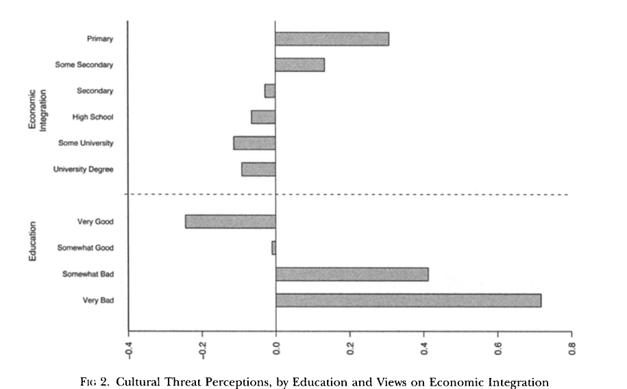
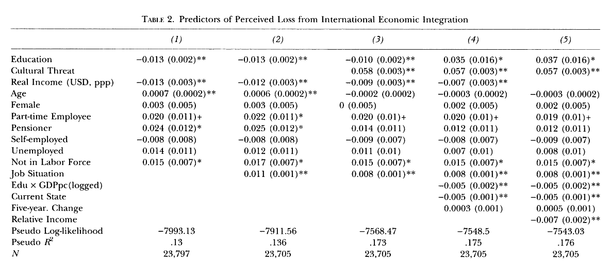
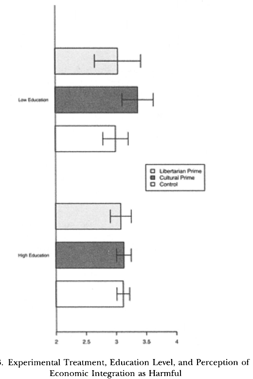
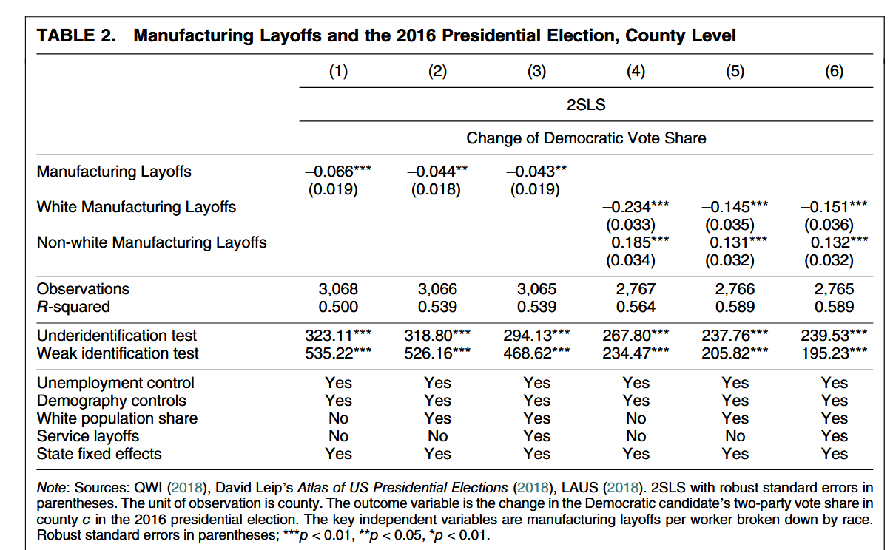
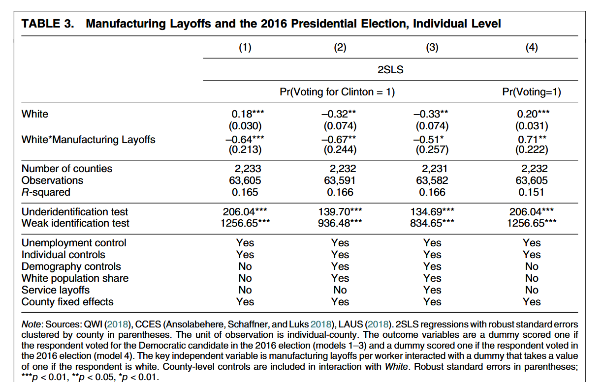

## Our calendar

- February 17 (Tuesday): Paper presentations 1
- February 20 (Friday): February break (no class)
- February 25 (Wednesday): FUS sustainability talk (no regular class on Tuesday)
- February 27 (Friday): FUS event - Forecasting World Affairs (no regular class on Friday)
- March 3 (Tuesday): <u>Midterm</u> [in class]

## Today
- Are economic consequences the whole story?
- Does globalization threaten cultural preferences and identity?
- What is the relationship between economic and cultural concerns?


## Limitations of economic explanations: Margalit (2019)

- What are *outcome significance* and *explanatory significance*? 
- What is his argument on *changes* vs *levels*? 

- Outcome significance: the economic voting backlash against the China shock is large enough to flip a close election
    - That is, the "Remain" option would have won in the UK without it 

- But the real question is: why ~50% of voters supported "Leave" to begin with

- Purely economic explanations have less "explanatory significance": they cannot account for most of the variation


## Outcome vs explanatory significance

Take the study of Colantone and Stanig (2018) on the effect of "China shock" on radical right support

::: columns
::: {.column width="50%"}
```{r}
#| echo: false
#| fig-width: 8
#| fig-height: 4.5
#| out-height: "450px"    
#| out-width: "auto"      
#| 
library(ggdag)
library(ggplot2)

# Create an IV DAG
dag_iv <- dagify(
  Vote ~ Imp. + C,
  Imp. ~ Z + C,
  coords = list(x = c(Z = 1, C = 2, Imp. = 1.8, Vote = 2.6),
                y = c(Z = 2, C = 2.5, Imp. = 1, Vote = 1))
)

ggdag(dag_iv, node_size = 12) +
  theme_dag() +
  labs(title = "Colantone & Stanig IV Strategy:\nEstimated Effect: Imp. → Vote = 0.7 pp") +
  theme(plot.title = element_text(hjust = 0.5, size = 12))
```
:::
::: {.column width="50%"}
```{r}
#| echo: false
#| fig-width: 6
#| fig-height: 4.5

library(ggplot2)

# Create data for stacked bar (right) and zoom bar (left)
data_stacked <- data.frame(
  x = "Total Vote",
  y = c(0.7, 3.97),
  component = c("Import Effect", "Other")
)

data_zoom <- data.frame(
  x = "Import Effect\n(0.7 pp)",
  y = 0.7,
  component = "Import Effect"
)

ggplot() +
  # Right bar (stacked)
  geom_bar(data = data_stacked, 
           aes(x = x, y = y, fill = component), 
           stat = "identity", width = 0.5) +
  # Left bar (zoom)
  geom_bar(data = data_zoom, 
           aes(x = x, y = y, fill = component), 
           stat = "identity", width = 0.5) +
  # Arrow from right to left
  annotate("segment", 
           x = 1.85, y = 4, 
           xend = 1.2, yend = 0.35,
           arrow = arrow(length = unit(0.3, "cm"), type = "closed"),
           size = 1, color = "black") +
  scale_fill_manual(values = c("Import Effect" = "#E74C3C", "Other" = "#BDC3C7")) +
  scale_x_discrete(limits = c("Import Effect\n(0.7 pp)", "Total Vote")) +
  labs(
    title = "Import Effect is a fraction of total radical right vote",
    y = "Percent",
    x = NULL
  ) +
  theme_minimal() +
  theme(
    legend.position = "bottom",
    legend.title = element_blank(),
    plot.title = element_text(size = 11, hjust = 0.5),
    axis.text.x = element_text(size = 10)
  ) +
  ylim(0, 5.5)
```
:::
:::

The effect of import they estimate is a minor part of the overall support for the radical right in Europe

. . . 

["What is the effect of something" is a different question from "what is the cause of a phenomenon"]{.remark}


## Towards non-economic explanations

Non-economic issues (cultural, national) are prominent in the rhetoric of anti-globalization forces

They challenge the "standard" rational choice theory that voters are primarily motivated by their self interest

Perhaps we should revisit our theories and assume that people are motivated by something beyond their direct interest, which has to do with their view of society


# Economic interpretations of cultural concerns {.section}

## The sources of popular discontent: Margalit (2012)

Is opposition to globalization driven by individual economic voting?

Motivations for the research question:

- Economic theories predict that people oppose globalization if they are likely to be economic "losers". E.g., they work in an exposed sector of the economy
    - But employment sector and attitudes towards globalization are not strongly linked in public opinion surveys
- Low-skill workers should be opposed to globalization in high-skill economies and in favor in low-skill economies
    - Yet, people with low education (correlated with skills) oppose globalization independently of their country's economy type
- The observed correlation between opposition to globalization and nationalist views is not well understood
    - Is it causal?
- $\implies$ bringing in concerns about globalization and social/cultural change can rationalize these facts

. . . 

::: {.callout-note title="Research question"}
Do concerns about social/cultural consequences of globalization cause concerns about its economic effects?
:::

## The sources of popular discontent: Margalit (2012)

The argument: openness of a country is a "package" of economic and cultural issues

(Note: outer y-labels should be flipped)



. . . 

The concept of being a  "loser" of globalization is shaped by concerns about both issues

## The sources of popular discontent: Margalit (2012)

A way to see this more formally: correlations




## A survey experiment

From our causal inference lecture: 

- <u>Survey experiments</u>. Treatment administration and outcome measurement happen within a survey.
    - Used to understand how information or communication affects voters' attitudes or opinions 

. . . 

::: columns
::: {.column width="60%"}
```{r}
#| echo: false
#| fig-width: 10
#| fig-height: 6

library(ggplot2)
library(grid)

# Create a flowchart for survey experiment design
ggplot() +
  # Starting pool
  annotate("rect", xmin = 4, xmax = 6, ymin = 4.5, ymax = 5.5, 
           fill = "#3498DB", alpha = 0.7) +
  annotate("text", x = 5, y = 5, label = "Survey\nRespondents", 
           size = 5, fontface = "bold", color = "white") +
  
  # Arrow down to randomization
  annotate("segment", x = 5, y = 4.5, xend = 5, yend = 4,
           arrow = arrow(length = unit(0.3, "cm"), type = "closed"),
           linewidth = 1.2) +
  
  # Randomization box
  annotate("rect", xmin = 4, xmax = 6, ymin = 3.5, ymax = 4, 
           fill = "#95A5A6", alpha = 0.7) +
  annotate("text", x = 5, y = 3.75, label = "Random Assignment", 
           size = 4.5, fontface = "bold") +
  
  # Arrows to treatment and control
  annotate("segment", x = 4.5, y = 3.5, xend = 2.5, yend = 2.8,
           arrow = arrow(length = unit(0.3, "cm"), type = "closed"),
           linewidth = 1.2) +
  annotate("segment", x = 5.5, y = 3.5, xend = 7.5, yend = 2.8,
           arrow = arrow(length = unit(0.3, "cm"), type = "closed"),
           linewidth = 1.2) +
  
  # Treatment group
  annotate("rect", xmin = 1, xmax = 4, ymin = 2.2, ymax = 2.8, 
           fill = "#E74C3C", alpha = 0.7) +
  annotate("text", x = 2.5, y = 2.5, label = "Treatment Group", 
           size = 5, fontface = "bold", color = "white") +
  
  # Control group
  annotate("rect", xmin = 6, xmax = 9, ymin = 2.2, ymax = 2.8, 
           fill = "#27AE60", alpha = 0.7) +
  annotate("text", x = 7.5, y = 2.5, label = "Control Group", 
           size = 5, fontface = "bold", color = "white") +
  
  # Treatment questions
  annotate("rect", xmin = 0.8, xmax = 4.2, ymin = 1.4, ymax = 2, 
           fill = "#E74C3C", alpha = 0.3) +
  annotate("text", x = 2.5, y = 1.85, label = "Treatment Questions:", 
           size = 4, fontface = "bold") +
  annotate("text", x = 2.5, y = 1.55, 
           label = "Topic: Social/cultural issues", 
           size = 3.5) +
  
  # Control questions
  annotate("rect", xmin = 5.8, xmax = 9.2, ymin = 1.4, ymax = 2, 
           fill = "#27AE60", alpha = 0.3) +
  annotate("text", x = 7.5, y = 1.85, label = "Control Questions:", 
           size = 4, fontface = "bold") +
  annotate("text", x = 7.5, y = 1.55, 
           label = "'Neutral' questions", 
           size = 3.5) +
  
  # Outcome measurement
  annotate("rect", xmin = 1.5, xmax = 8.5, ymin = 0.1, ymax = 1.1, 
           fill = "#F39C12", alpha = 0.7) +
  annotate("text", x = 5, y = 0.9, 
           label = "Same Outcome Question for Both Groups", 
           size = 4.5, fontface = "bold") +
  annotate("text", x = 5, y = 0.5, 
           label = '"Do you think that growing trade and business ties of the United States\nwith other countries have made the average American better or worse off?"', 
           size = 3.5) +
  
  xlim(0, 10) +
  ylim(0, 6) +
  theme_void() +
  labs(title = "Survey Experiment Design") +
  theme(plot.title = element_text(hjust = 0.5, size = 16, face = "bold"))
```
:::

::: {.column width="40%"}
- **Units**: survey respondents
- **Treatment**: random assignment to questions on cultural issues
- **Outcome**: views on free trade
- Answering questions about cultural issues makes people think about them and makes cultural concerns more salient in people's minds
:::
:::


## Cultural concerns and opposition to globalization

::::{.columns}
::: {.column width="60%"}

:::
::: {.column width="40%"}
- The "cultural prime" increases concerns about free trade, but only among low-education respondents
- What are the implications for "economic self-interest" theories of preferences towards globalization? Does it mean that economic interests do not explain voters' backlash against globalization?
- No, individual interest clearly matters. But it suggests that some groups of voters prioritize other dimensions of their life that are impacted by globalization
- Since globalization is a "package" of economic and non-economic elements, concerns "spill over" other issues
:::
::::

## Implications for studying the political consequences of globalization

In the author's words:

> [...] in thinking about the  political manifestations of discontentment with globalization, the anti-openness political "camp" should be seen as encompassing individuals with highly divergent concerns and beliefs. Some oppose  economic integration because it exposes them to the risks of lower income, job insecurity, and  unemployment. Others, however, oppose economic integration because it is seen as part of a broader process of change that affects some of the things they care most deeply about, be it the values and ideas that their children are exposed to, the traditions respected in their society, or their national and cultural identity. Studying the opposition to trade liberalization and economic globalization more broadly as driven merely by its distributive consequences is therefore a framework that is too narrow and which leaves out much of what is politically significant about the phenomenon in question.

# Cultural interpretations of economic concerns {.section}

## Economic shocks and globalization backlash: do social identities matter?

Baccini and Weymouth (2021) study whether economic shocks (layoffs in the manifactural sector) have asymmetric effects depending on social group identity

Their argument:

- In societies with long-standing group inequalities, historically privileged groups have concerns about their relative status
- As a reaction to economic shocks, they are likely to see their status degraded and support candidates who appeal to their "group pride"

## Research design: IV

```{r}
#| echo: false
#| fig-width: 8
#| fig-height: 4.5
#| out-height: "450px"    
#| out-width: "auto"      
#| 
library(ggdag)
library(ggplot2)

# Create an IV DAG
dag_iv <- dagify(
  Vote ~ L.off + C,
  L.off ~ Z + C,
  coords = list(x = c(Z = 1, C = 2, L.off = 1.8, Vote = 2.6),
                y = c(Z = 2, C = 2.5, L.off = 1, Vote = 1))
)

ggdag(dag_iv, node_size = 12) +
  theme_dag() +
  labs(title = "Baccini & Weymouth IV Strategy:\nLayoffs in other counties instrument layoff in own country") +
  theme(plot.title = element_text(hjust = 0.5, size = 12))
```

|                    | **Design 1** | **Design 2** |
|--------------------|--------------|--------------|
| **Units**          | Counties | Survey respondents |
| **Treatment**      | Manufacturing layoffs by race in the county | Manufacturing layoffs by race in the county |
| **Outcome**        | Change in vote share for Dem (2012-2016) | Individual vote for Dem (2016) |
| **Instrument**     | Manufacturing layoffs by race in the rest of the country × weight of manufacturing in the county's labor force | Manufacturing layoffs by race in the rest of the country × weight of manufacturing in the county's labor force |

## Results   

Communities react differently to layoffs depending on the racial composition of the layoffs



. . . 

Layoffs favor Trump over Clinton, but this is mostly driven by layoffs of white workers

## Results

At the individual-level, layoffs of white workers increase the racial gap in vote for Trump



. . . 

White voters are significantly less likely to vote for Clinton (keeping constant age, education, gender, employment, and senator approval). In areas with more layoffs, they are even less likely to vote for Clinton.

## Mechanisms

Questions for the class:

- What are the alternative mechanisms that they try to rule out?
- Are you convinced?
- What tests would be convincing?

. . . 

(Bonus question)

- This is another "high outcome significance" result. Does it have "explanatory significance" too?

## Globalization backlash: economics or culture?

This question has characterized research for the last decades. This binary view is misguided

People have both economic and social/cultural motivations. We should probably be asking

- How do the economic and the cultural sphere interact?
- What coalitions of voters are formed


## Next
- Migration (after the midterm)

