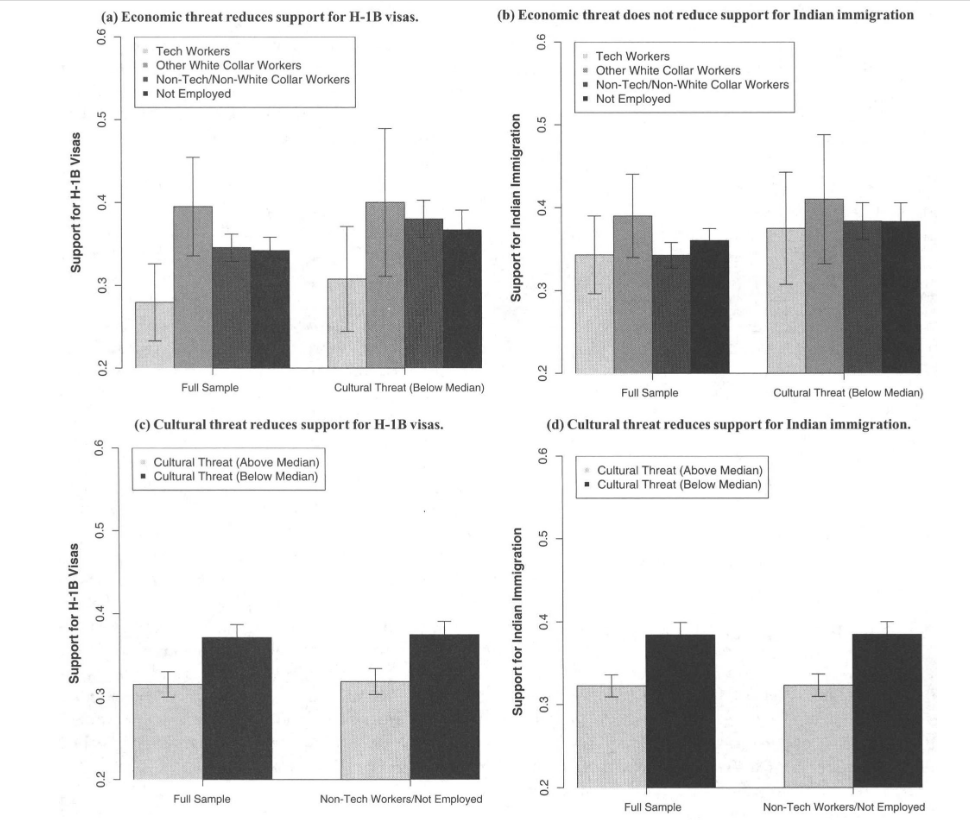
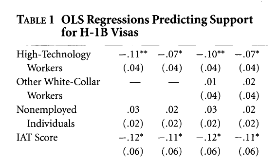
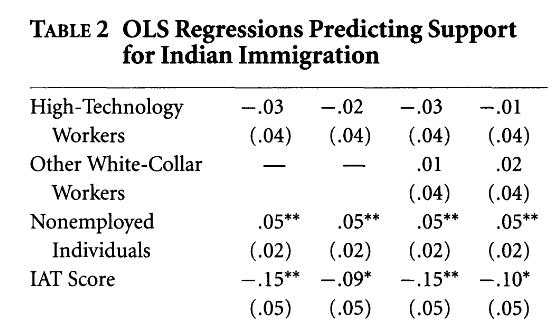
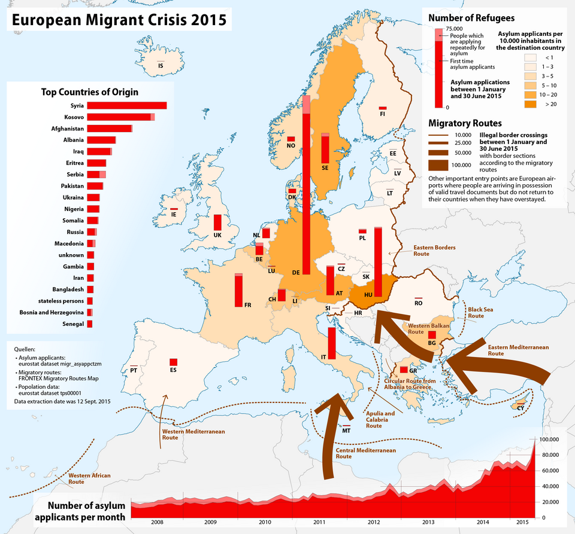
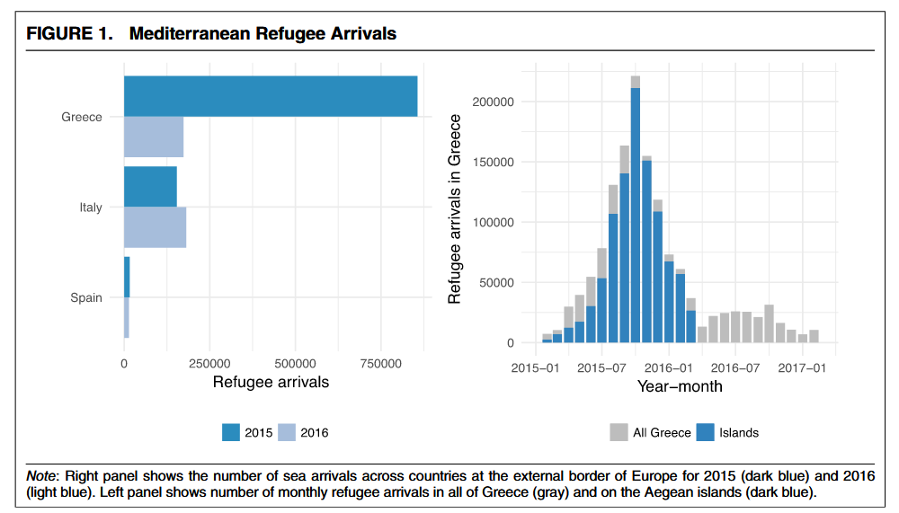
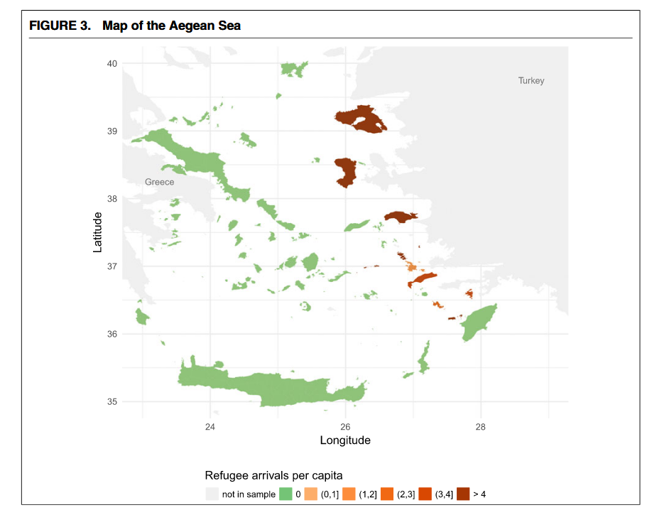
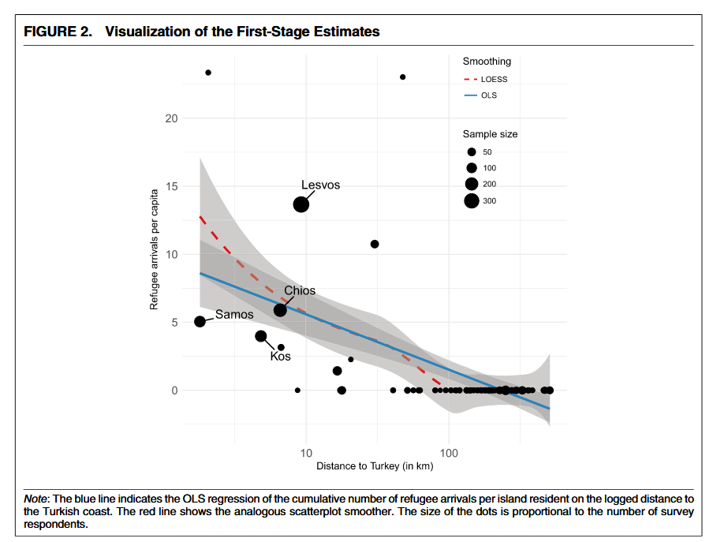
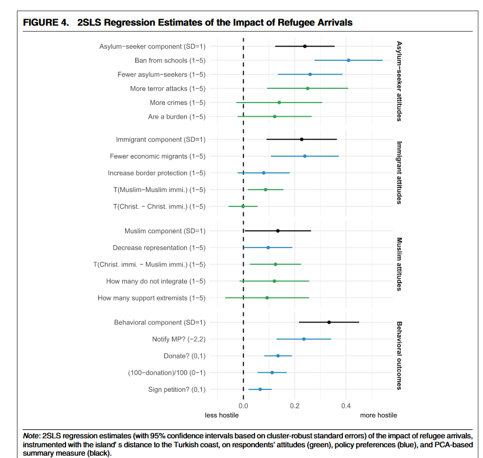

## Today
- Focus on the most tangible "cultural" shock of the globalization era: [immigration]{.alert}
- How are voters' attitudes shaped by immigration? Economic and cultural concerns

# Globalization and immigration {.section}

## Globalization and immigration

In our discussion of what globalization does, immigration has been in the background

Yet, market integration and migrations are highly correlated

- In free market areas like the EU, free circulation of workers is possible
- Humanitarian crises in the last 10 years, e.g., Syrian civil war

. . . 

Opposition to immigration is the signature issue of anti-globalization parties

## Does immigration have its own role?

Economic interpretations of the anti-globalization backlash see cultural concerns about immigration as "epiphenomenal" relative to negative economic shocks

> We regard immigration not as a first order economic determinant of electoral outcomes, but rather as a visible catalyst for the political consequences of the economic distress driven by structural changes such as globalization and technological progress
>
> Colantone and Stanig (2019)

# Economic and cultural concerns {.section}

## Opposition to immigration

Why should native oppose immigration? Two broad families of hypotheses

- **Labor market competition**: immigrants compete with locals for jobs 

- **Cultural threat**: immigrants undermine local culture and way of life

. . . 

Are these mechanisms prevalent in the population? Which one is more important?

Problems (Malhotra et al 2013): 

- The evidence for labor market competition mechanism is mixed 
- Labor market and cultural threats are likely correlated in the population (why?)

## Disentangling economic and cultural concerns

Malhotra, Margalit, and Mo (2013)

- **Argument**: both mechanisms are present, but cultural concerns are widespread, while labor market concerns are localized

- **Setting**: a "most likely case" for Labor Market Competition (LMC): US counties with high-tech sector concentration (why?)

- **Outcome**: attitudes towards H1B visas (largely Indian immigrants)

- **Independent variables**: exposure to LMC from Indian H1B holders (tech workers vs others), "implicit cultural prejudice" against Indians as a whole (Implicit Association Test)

. . . 

[Note: is this design causal or descriptive/correlational?]{.remark}

## Disentangling economic and cultural concerns

- Tech workers are opposed to more H1B for Indians, but not opposed to Indian immigration as a whole

- Respondents with latent prejudice against Indians are opposed to both

## Disentangling economic and cultural concerns

## Disentangling economic and cultural concerns

## Authors' conclusions

- Both LMC and cultural threats are present, but LMC has *low prevalence* in the population
- You only see it in highly specific job market contexts, towards highly specific immigration policies (rather than "immigration as a whole")
- Cultural concerns are more widespread in the population and explain a higher part of the observed opposition to immigration

# Immigration shocks: the European refugee crisis

## The European refugee crisis

## The European refugee crisis

A massive wave of refugees and asylum seekers

## Understanding the consequences of the refugee crisis

Hangartner, Dinas, Marbach, Makatos, and Xefteris (2019) study the consequences of exposure to the refugee crisis in Greece

What is relevant about the case of Greece?

. . . 

Does this geographic pattern suggest a research design?

## Understanding the consequences of the refugee crisis

:::: {.columns}
::: {.column width="50%"}
- **Units**: people (Greek respondents across Aegean Islands)
- **Treatment**: refugee arrivals in the island
- **Instrument**: distance from the Turkish coast
- **Outcome**: attitudes and policy preferences towards immigration

:::
::: {.column width="50%"}

:::
::::

## Understanding the consequences of the refugee crisis

Exposure to massive refugee inflows increases local opposition to accepting asylum-seekers, but also to immigration in general

## Authors' discussion

- Exposure to the refugee crisis increases opposition to immigration and cultural "others"
- Refugees did not remain in the arrival islands, so the effects are attributed to the arrival experience
- An important caveat: the size of this shock was massive. It generated a huge increase in the salience of the immigration issue 
- Still, the shock arising from large, chaotic refugee inflows can be a powerful catalyst of political attitudes and preferences

## Next
- Technological change (after academic travel)