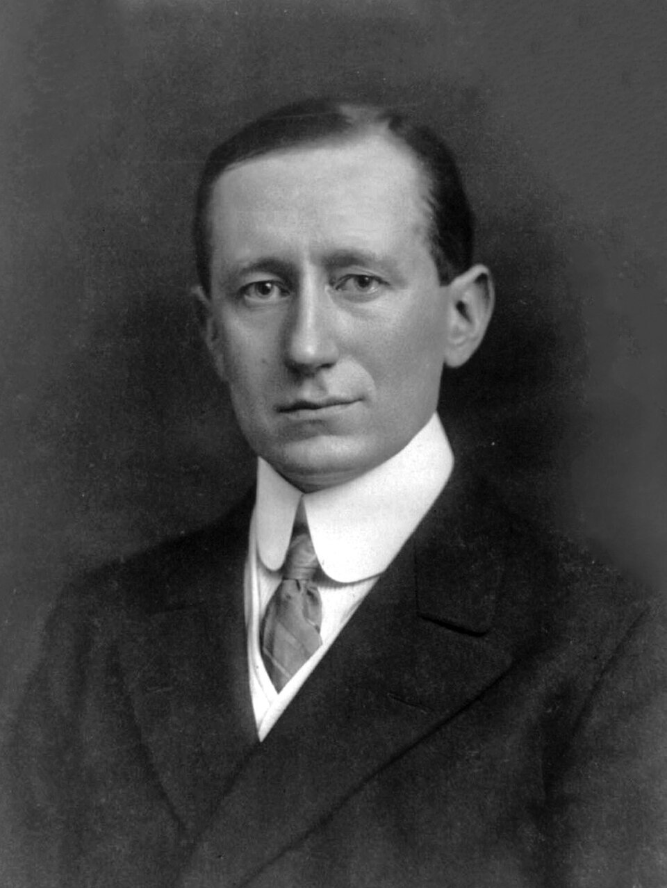
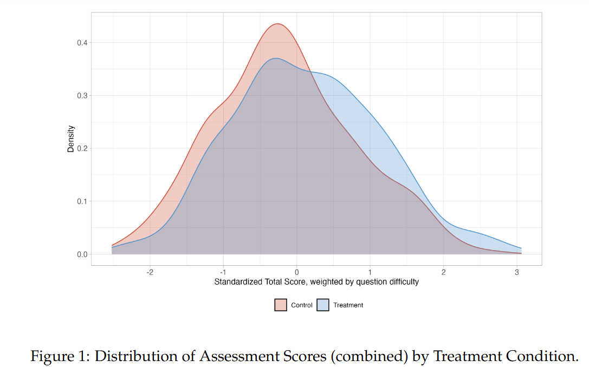
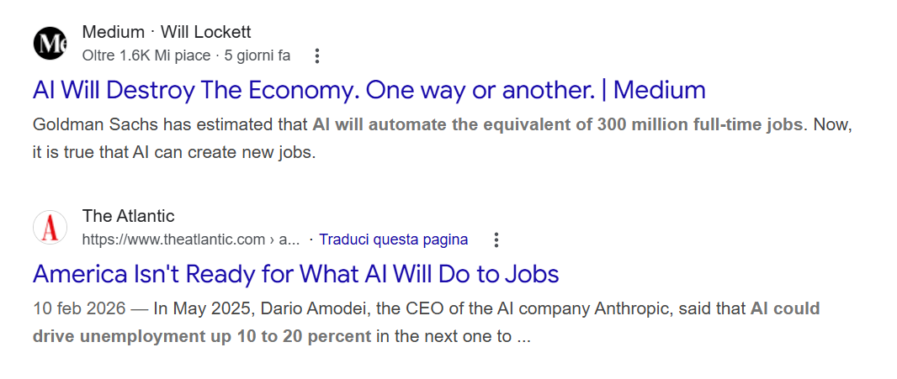
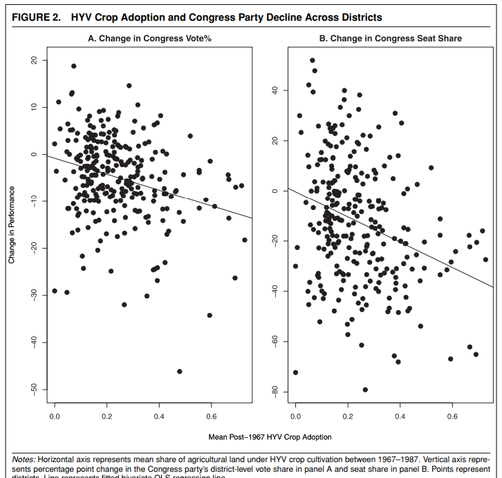
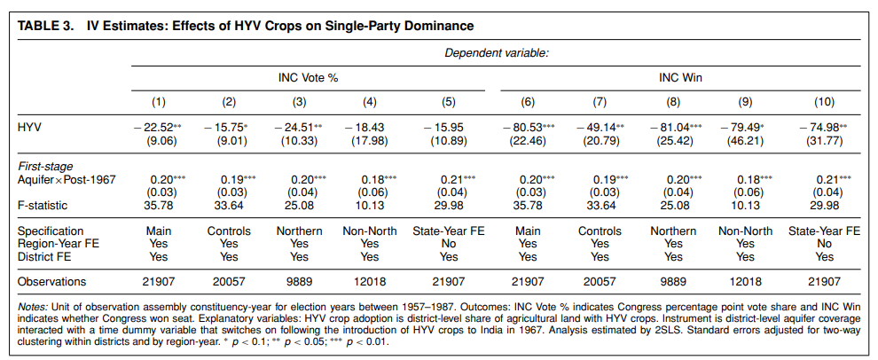
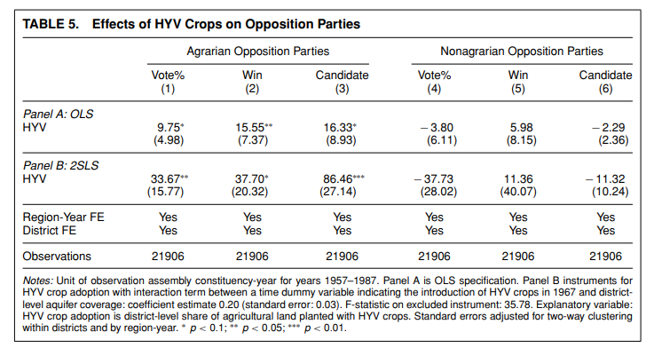
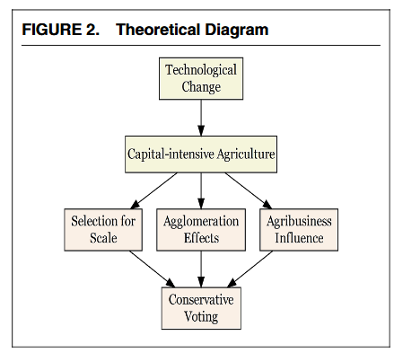
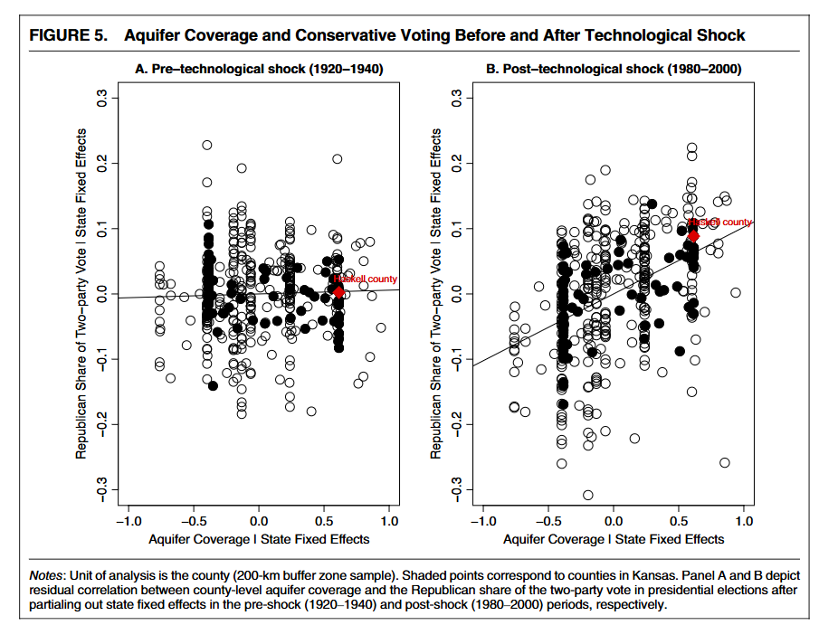

# Introduction {.section}

## Who are these people?

::::{.columns}
::: {.column width="30%"}

:::
::: {.column width="30%"}

:::
::: {.column width="30%"}

:::
::::

## Technology and politics

In this module we will talk about the consequences of technology for the economy and politics

- Technological change is the main engine of human economic development
- It moves the economic frontier and redefines what can be done 
- It alters economic relations between actors
- It changes the costs and benefits from economic activity and consequently political demands

## Class survey

- In what application/domain do you use AI more often?
- Where do you think it can be most useful?
- Where do you think it can be dangerous?

## The promise of emancipation

**From Chalkboards to Chatbots : Evaluating the Impact of Generative AI on Learning Outcomes in Nigeria (English)**
 [World Bank](https://documents.worldbank.org/en/publication/documents-reports/documentdetail/099548105192529324)

## Costs of adoption: economic disruptions

## Consequences of technological control

## Political value of technology

## Today

- Can the international diffusion of technology alter domestic political relations?
- Can it **empower** some social groups?

# Historical evidence {.section}

## The Green Revolution and democratic politics in India

Dasgupta (2018) studies the effects of the Green Revolution on the party system in India after 1967

. . . 

Argument:

- Technological change as **"creative destruction"**: Major innovations can disrupt the distribution of political power in a society, weakening entrenched political elites and empowering political outsiders
- Three mechanisms link new technology to political turnover:
  1. <u>Wealth</u>: Increases the financial capacity of politically excluded groups
  2. <u>Incentives</u>: Economic motivations for these groups to seek political representation, especially if the new technology's success depends on government policy
  3. <u>Collective Action</u>: Shared economic interests and a focal point (lower prices) provide incentives to coordinate

## Historical setting: the Green Revolution

High-Yielding Variety (HYV) crops drastically improved agricultural productivity, sparking a shift to commercialized agriculture from the late 1960s

- Benefited economically the small landholder agrarian classes, from middle-lower castes and historically excluded from the country elites $\rightarrow$ Congress party

- HYV  crops required intensive inputs (e.g., fertilizer, electricity...) and caused crop prices to fall $\implies$ government procurement price and input subsidies become focal

- Stronger incentives to influence public policy at the state and then national level

- Study the rise of agrarian parties as a consequence of increased rural political mobilization and coordination

. . . 

[This is essentially the same mechanism we have encountered in Rogowski's theory of trade cleavages]{.remark}

## Research Design

- **Unit**: Indian districts (over time)
- **Treatment**: HYV crop adoption (share of district land planted with HYV crops)
- **Outcome**: (i) Vote share for the Congress party, (ii) probability of winning a local seat
- **Instrument**: Share of land with naturally-occurring acquifer (interacted with post-1967)

## Results: the demise of the Congress party

{fig-align="center"}

## Results: the demise of the Congress party

## Results: the rise of opposition parties

## Another historical case: irrigation technology and rural partisanship in the US

In a related study, Dasgupta and Ramirez (2025) study the consequences of innovations for irrigation in the US

. . . 

The argument:

::::{.columns}
::: {.column width="50%"}

- Technological innovation drives the rise of rural conservatism by transforming agriculture into a highly productive but capital-intensive industry, empowering agribusiness 
- Mechanisms that link this technological shift to conservative voting:
  1. <u>Selection for Scale</u>: Consolidates land and wealth among large-scale farm operators who favor pro-business tax and spending policies
  2. <u>Agglomeration Effects</U>: Downstream industries (e.g., feedlots and meatpacking) cluster together, giving agribusiness "structural power" over rural communities.
  3. <u>Agribusiness Influence</u>: Shape local politics through organized lobbying, campaign finance, and elite agenda-setting

:::
::: {.column width="50%"}

:::
::::

## The Historical Case

Technological innovations in the American Great Plains (post-WWII)

- Introduction of petroleum-powered deep well pumps and center-pivot irrigation allowed farmers to economically extract massive amounts of groundwater from the Ogallala Aquifer 
- Historically, precarious dryland farmers in this region often supported left-wing or centrist populist movements, like the Populist Party or the New Deal 
- The new technology makes farming highly productive but reliant on capital (machinery, land, inputs)
- Shifts political preferences toward economic conservatism: opposition to regulation and taxation

## Results

Similar logic as before: not IV, but the treatment is (Aquifer coverage $\times$ Post)

[This is a Difference-in-Differences design, see the last slides in session 3]{.remark}

. . . 

## Takeaways

- Technological changes reshape economies, creating winners (and losers)
- They also reshape political systems, by empowering some groups and pushing them to influence politics more
- In some cases they can transform or reinforce some political cleavages
- "Creative distruction" of old elites and interest groups, but possible entrenchment of new ones

## Next

- Who are the discontents of technological change?