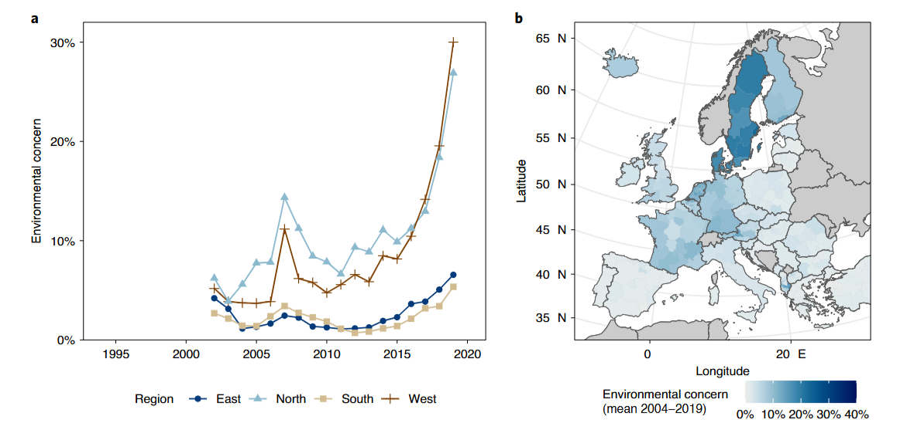
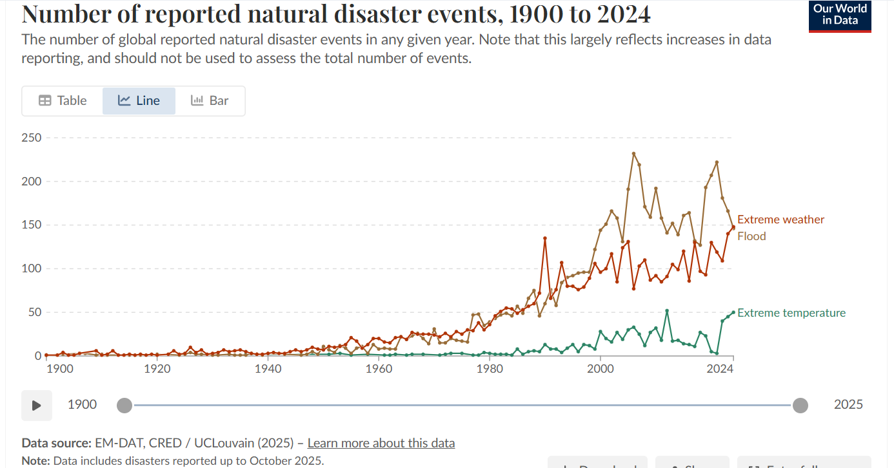
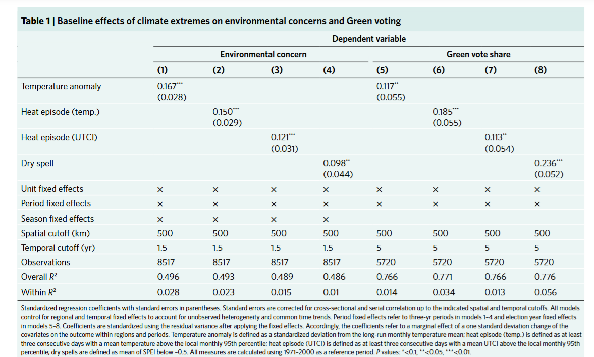
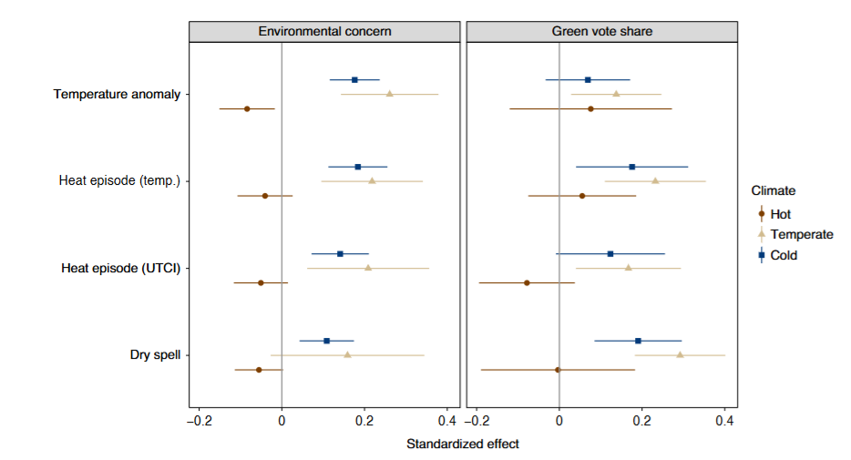
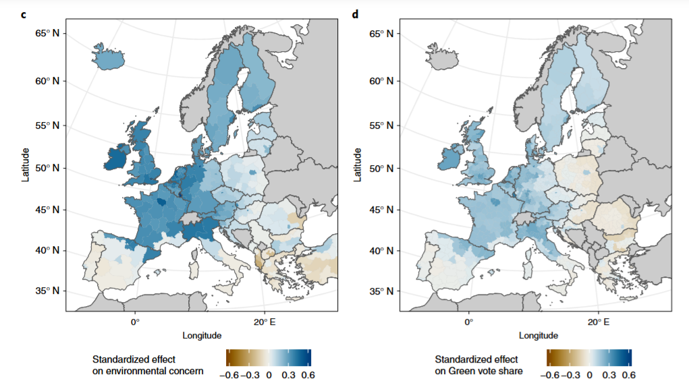
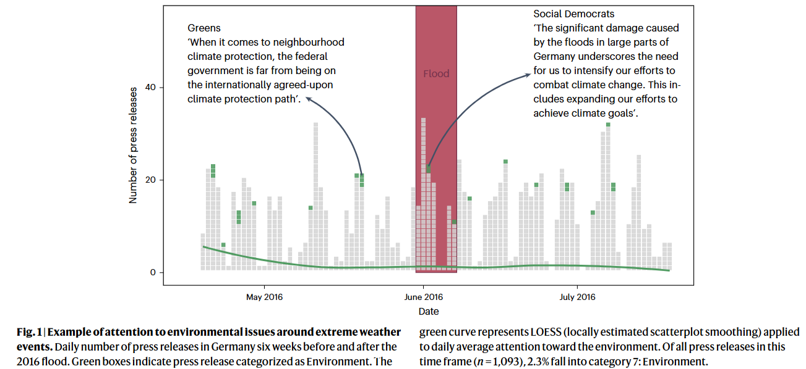

## Housekeeping

Upcoming course milestones:

- **April 14**: Second round of presentations
- **April 24**: Research design due
- **April 28** and **May 1**: Short design presentations

## Today's plan

 A new currently relevant topic: [climate change]{.alert}


::::{.columns}
::: {.column width="60%"}

```{r}
#| engine: tikz
#| echo: false
#| fig-align: center
#| fig-ext: svg

\begin{tikzpicture}[
    node distance=4.5cm,  % <--- Increased distance to make arrows longer
    % --- Styles ---
    levelbox/.style={
        rectangle,
        draw=black!60,
        fill=blue!10,
        rounded corners=5pt,
        minimum width=7cm,
        minimum height=1.5cm,
        align=center,
        font=\sffamily\bfseries\large
    },
    upstream/.style={
        ->, >=stealth,
        line width=2pt,
        color=black!70
    },
    downstream/.style={
        ->, >=stealth,
        line width=1.5pt,
        color=red!70,
        dashed
    },
    % New style for the labels on the arrows
    arrowlabel/.style={
        midway,
        fill=white,         % Hides the arrow line behind the text
        align=center,
        font=\small\sffamily,
        text width=4cm,     % Forces text to wrap if its too long
        text=black!80
    }
]

    % --- Nodes ---
    \node[levelbox] (intl) {Relations between States};
    \node[levelbox, below of=intl] (pol) {Elected Politicians};
    \node[levelbox, below of=pol] (voters) {Voters and Society};

    % --- Arrows ---
    
    % Upstream 1: Voters -> Politicians
    \draw[upstream] (voters.north) -- node[arrowlabel] {Voters elect / keep politicians accountable} (pol.south);
    
    % Upstream 2: Politicians -> International
    \draw[upstream] (pol.north) -- node[arrowlabel] {Politicians decide on relations} (intl.south);

    % --- Downstream (Feedback) ---
    
    % Politicians -> Voters (Right side)
    \draw[downstream] (pol.east) to[out=0, in=0, looseness=1.5] node[midway, right, font=\footnotesize, text=black] {Policy Impact} (voters.east);

    % International -> Voters (Left side)
    \draw[downstream] (intl.west) to[out=180, in=180, looseness=1.2] node[midway, left, font=\footnotesize, text=black] {Shocks} (voters.west);

\end{tikzpicture}
```
:::
::: {.column width="40%"}


- Today: formation of political attitudes on climate domestically

- Do actual manifestations of climate change affect people's attitudes?

- Next: how climate gets intermingled with other issues and how this affects international cooperation

:::
::::


## Activity

Work with your neighbor

1. Visit [https://ourworldindata.org/co2-and-greenhouse-gas-emissions](https://ourworldindata.org/co2-and-greenhouse-gas-emissions)
    - Visualize per capita emissions for the world in a map
    - Visualize the emission trends for: EU (28), USA, China, India
    - What patterns do you see in each case?


2. Visit [https://ourworldindata.org/grapher/temperature-anomaly?time=1850..2025&tab=line](https://ourworldindata.org/grapher/temperature-anomaly?time=1850..2025&tab=line)
    - What pattern do you see?


3. Visit [https://ourworldindata.org/grapher/global-temperature-anomalies-by-month](https://ourworldindata.org/grapher/global-temperature-anomalies-by-month)
    - Select the month of December
    - What do you see?


## Addressing climate change through policy

As these trends suggest, climate change poses a serious threat to human societies. Why did its *political* salience increase so much only in recent years?

::::{.columns}
::: {.column width="50%"}

:::
::: {.column width="50%"}

:::
::::

- Climate change is relatively slow and gradual (over a human's life)
- (Possible) increase in extreme climate events 


## Addressing climate change through policy

The most important policy goal to mitigate climate change is decarbonization. What are the key economic and political challenges?

. . . 

- At the [international]{.alert} level, it is an issue requiring substantial coordination between countries. Why?
    - Recall the concepts of [externality]{.alert} and [social dilemma]{.alert}
    - Any example?
- At the [domestic]{.alert} level, it appears to be a universal goal but it has some clear distributive consequences
    - Any example?

. . . 

Such large changes require broad public support. But how do political attitudes about climate change form?


## Climate change experiences and environmental concern

Hoffmann et al (*Nature*, 2022) study the effects of experiencing extreme weather events on political attitudes and behavior


- **Units**: European regions
- **Treatment**: "geo-referenced" extreme weather events (temperature anomaly, heat, dry spells) 
- **Outcome**: average self-reported environmental concern in Eurobarometer (attitudes) and vote share for Green parties in European elections (behavior)

## Climate change experiences and environmental concern



## Climate change experiences and environmental concern



## Climate change experiences and environmental concern




## Do extreme weather events affect politicians' behavior?

Wappenhans et al (*Nature* 2024) asks whether extreme weather events, after changing voters' minds, also changes politicians' attention, measured by press releases. They find that that they probably don't

. . . 



## Discussion

Do experiences of climate change shift public opinion? And how?

. . . 

- Yes, but unevenly
- The effects seem depend on the overall climatic conditions
- Geographically, this correlates with other patterns: e.g., areas with higher income, education, and urban population become relatively more concerned
- Thinking about [cleavages]{.alert} what can be the implications for domestic politics?
- Why do you think we don't see effects on party statements? Are press releases a good measure of party stances?


## Next

- Concerns about climate vs concerns about the economy
