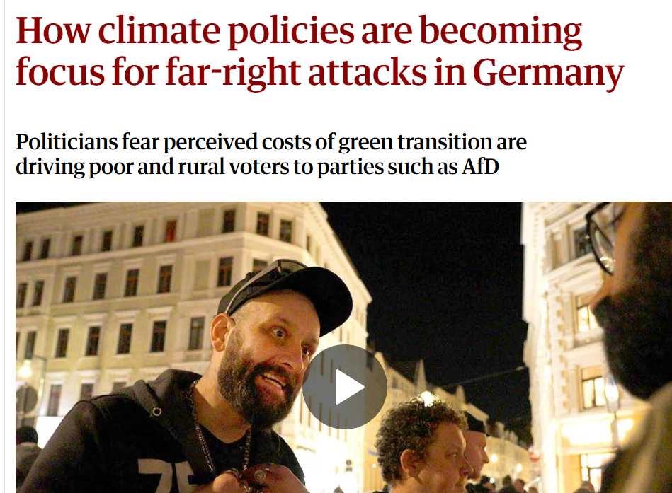
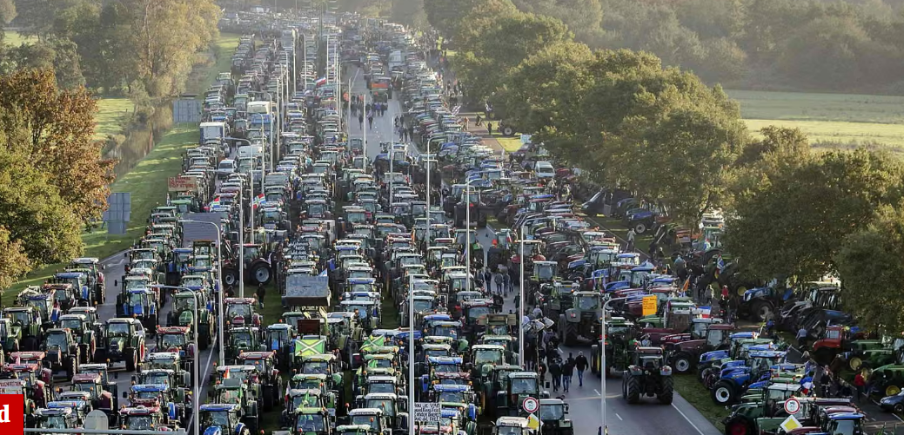
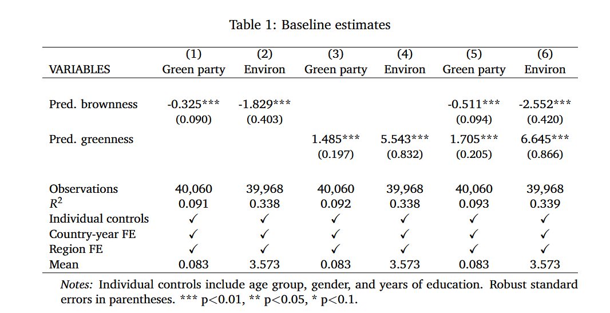
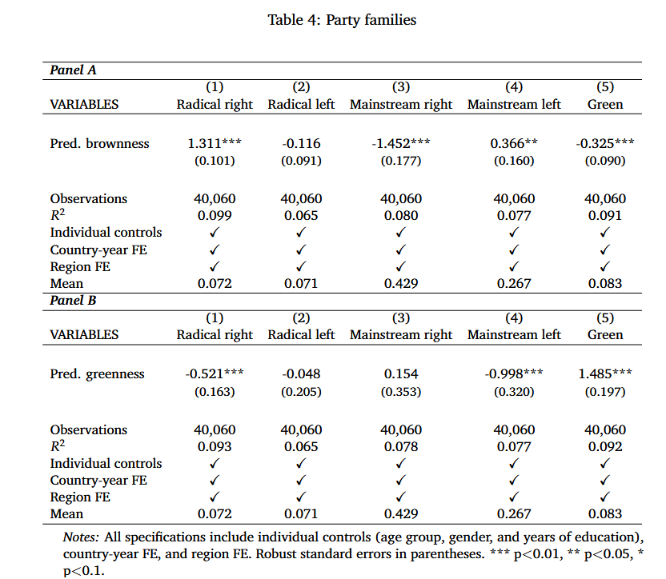
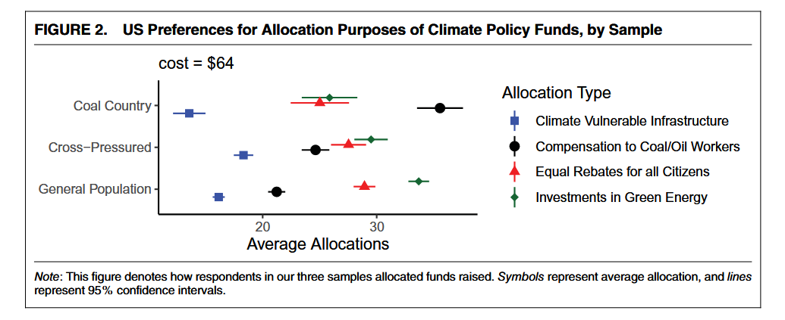
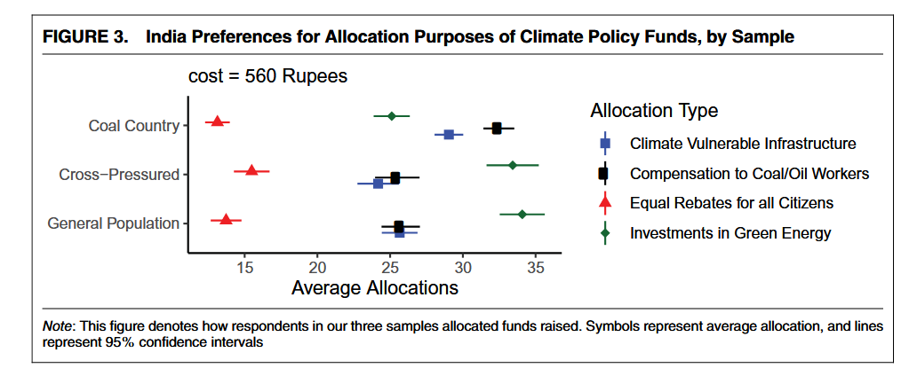
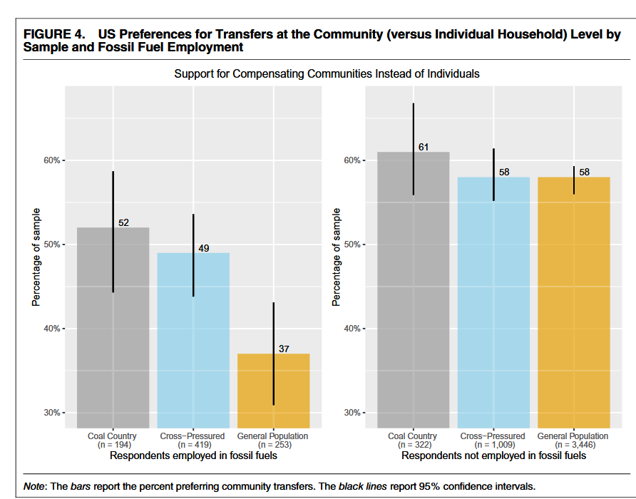
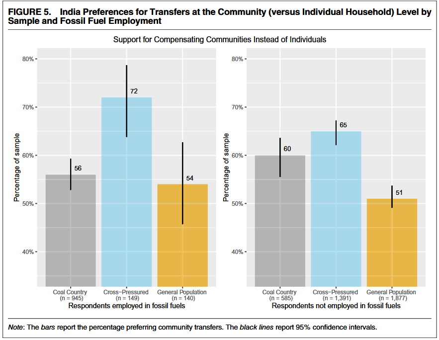

## Today

- Who are the winners and losers from green policies?
- How to take into account climatic and economic concerns?

## The climate vs the economy?

Green policies have distributive implications that can generate opposition among the groups most affected by it

::::{.columns}
::: {.column width="50%"}

:::
::: {.column width="50%"}

:::
::::

Governments have to navigate competing pressures from different social groups

## Class activity

Imagine that the government is considering implementing a set of reforms to significantly reduce the country's greenhouse gas emissions.

. . . 

Form 3 groups. Discuss the following points:

- What are the likely aggregate effects for the country for implementing these policies?

- Who is most likely to benefit? Who is most likely to pay?

- Suppose we want to compensate the losers. How do we identify them?

# Empirical evidence: material interests and environment preferences {.section}

## Green collars at the voting booth

Cavallotti, Colantone, Stanig and Vona (2025) study how material concerns shape voting on the environment issue 

. . . 

**Argument**:

- People's material interests are largely determined by their local labor market prospects (how likely a person "like me" is to work in a given occupation)
- The transition to a greener economy creates distributional consequences in the labor market: people with "green" occupational prospects (more likely to work in "green" jobs) are the "winners", people with "browner" profiles are the "losers"
- Voters evaluate their position in the green transition based on the spectrum of realistic opportunities available to them in each scenario
- Based on these interests, they evaluate environmental parties and platforms

## Research Design & Measurement Strategy

- **Data**: Individual-level survey data from the European Social Survey for 14 Western European countries (2010 to 2019)
- **Independent variable**: greenness and brownness scores that measure how "green" or "brown" are the occupational opportunities of a person 
    - Computed by estimating an individual's probability of employment in various occupations based on demographic characteristics such as age, gender, education, and region
    - Each occupation is given a green/brown score based on tasks and/or polluting potential
- **Outcome**: vote for Green parties; pro-environment orientation of the party voted

## Main results

## Main results

Where do these votes go?

# Building political coalitions {.section}

## Policy vs Climate change vulnerability

Gaikwad, Genovese and Tingley (2022) study the determinants of public opinion for compensation of losers from green policies 

. . . 

**Argument**:

- To build political coalitions in favor of decarbonization we need to understand how the public wants to compensate the losers from climate policies
- People form distinct climate compensation preferences based on their exposure to two forces: **policy vulnerability** (the risk of job and wage losses in carbon-intensive sectors) and **climate change vulnerability** (physical threats from climate change) 
- Less vulnerable individuals prefer diffuse, broad-based climate investments
- Policy-vulnerable groups demand targeted interventions
- Because fossil-fuel regions often feature shared *identities*, they prefer compensatory transfers directed at the *community* level rather than just to individual displaced workers 

## Research Design & Measurement Strategy

- **Context**: USA and India $\rightarrow$ 2 major democracies and greenhouse gas producers
- Surveys with different samples: **General Population** (nationally representative), **Coal Country** (policy-vulnerable), **Cross-Pressured** (physically and policy-vulnerable)
- To measure preferences, respondents allocate funds raised from hypothetical increased fossil fuel costs across four options: fossil fuel worker transfers, adaptation infrastructure, green energy investments, and equal citizen rebates 
- A follow-up question asks whether respondents prefer targeted funds to go to *individual households* or *entire communities* 

## Main results

Where do people prefer to allocate revenues from taxing carbon production?

::::{.columns}
::: {.column width="50%"}

:::
::: {.column width="50%"}

:::
::::

## Main results

People's preferences for community vs individual compensation

::::{.columns}
::: {.column width="50%"}

:::
::: {.column width="50%"}

:::
::::

# Policy problems {.section}

## Class activity (continued)

Re-form the groups.

In light of the discussion, what policies would you propose to reduce carbon emissions while protecting the "losers"?

## Next

- International cooperation for climate policy