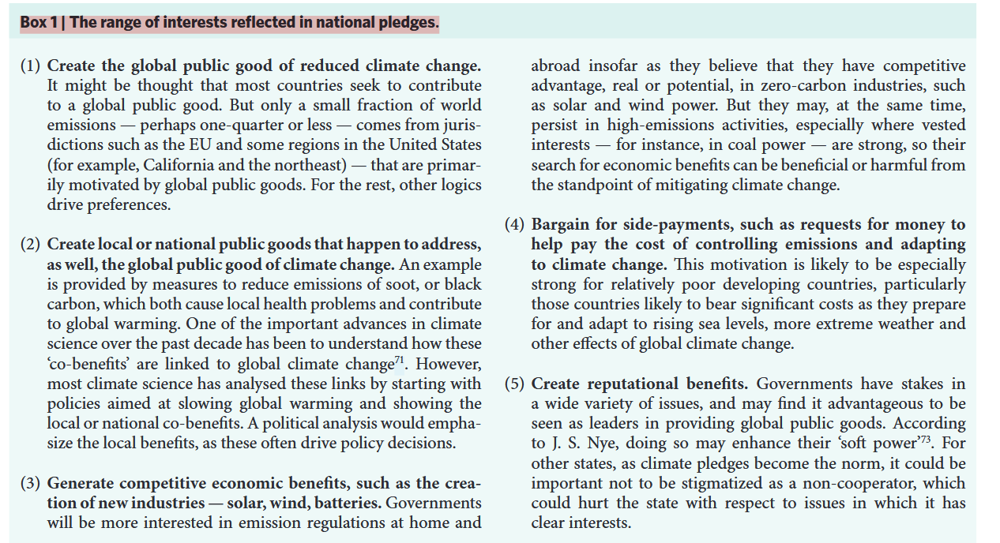
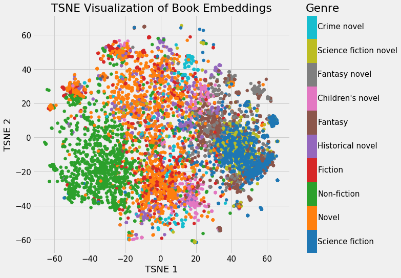
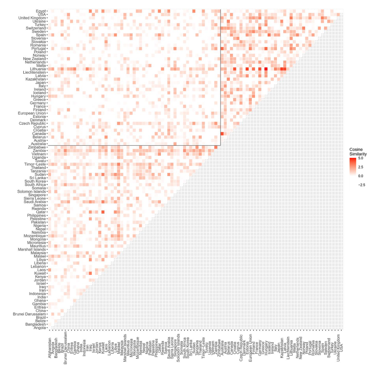
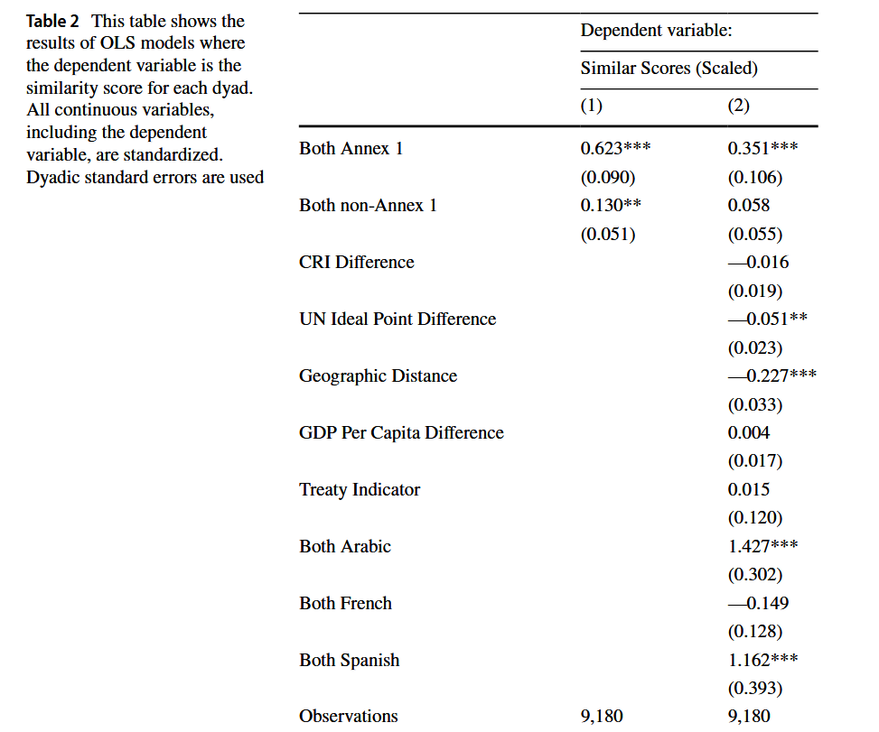
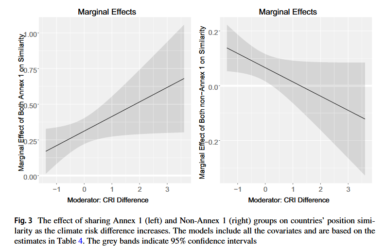

## Today

- International cooperation for climate policy
- Challenges to mitigation policies
- Institutional solutions

## Class activity

We will simulate negotiations for an international treaty to mitigate climate change.

[For example, the United Nations Framework Convention on Climate Change (UNFCCC)]{.remark}

Our goal: agree on a plan to significantly reduce greenhouse gas emissions.

. . . 

Form 3 groups:

:::{.nonincremental}

- Industrialized countries that mostly import fossil fuels
- Developing countries that mostly import fossil fuels
- Developing countries that produce and export fossil fuels

:::

. . . 

Discuss your proposals and bring them to the floor

# Institutions and cooperation on climate {.section}

## "Organized hypocrisy" as obstacle to cooperation

Keohane and Victor (*Nature climate change* 2016) assess the potential for international cooperation on climate change mitigation policies

. . . 

**Argument**:

- Continuous diplomatic talks and agreements (e.g., UNFCCC, Paris Agreement) had little real impact on reducing emissions 
- Climate politics suffers from "organized hypocrisy": climate *talk* without climate *action*
- International efforts produce [*shallow coordination*]{.hover-note data-tooltip="A situation where agreements are self-enforcing but have limited scope and yield only shallow gains."} rather than the [*deep cooperation*]{.hover-note data-tooltip="A situation where there are high potential gains from cooperating but agreements are not self-enforcing and create incentives to defect."} required to mitigate climate change

. . . 

Why so?

. . . 

$\implies$ a safe climate is a [global public good]{.alert}, leading to well known [social dilemmas]{.alert}

## Moving toward cooperation

Solving cooperation is an institutional design problem

- Universal agreements with legally binding targets and timetables on all countries may lead to deadlock $\rightarrow$ e.g., 2009 Copenhagen conference 
  - Why?
- Supporters of climate action should instead accept a "polycentric" global system and build cooperation incrementally through [regime complexes]{.alert}
- Example 1: **Climate clubs**. Small groups of nations that cooperate deeply and gradually expand
- Example 2: **Pledge and review**. Countries make individual pledges (INDCs) and review each other's progress
- Example 3: **Coordinated research**. Collaborative efforts to innovate and make clean energy cheaper than fossil fuels
- Example 4: **Coordinate national actions**. Focus on policies that are *individually rational* for the single countries involved

. . . 

$\implies$ step-by-step approach promises to build confidence and make deeper cooperation more likely

# What do countries want? {.section} 

## Preferences

Analyzing single countries' pledges to the UNFCCC reveals broad classes of motivations

## A closer look

Genovese, McAlexander, and Urpelainen (*RIO* 2023) analyze systematically the commonalities in countries' position in the UNFCCC

. . . 

- IR often focuses on the domestic origins of national positions, ignoring how institutional coalitions within IOs shape members' behaviors 
- HP1: Members of economically homogenous negotiation blocs are more likely to find common ground and have similar national statements than economically heterogeneous groups 
- HP2: For groups with mixed economic profiles, other cross-cutting dimensions can unify positions $\rightarrow$ shared climate vulnerability

## Research design 

- **Units**: dyads of countries within UNFCCC (recall past sessions on the determinants of trade)
- **Data**: official statements from 169 countries at annual UNFCCC conferences between 2010 and 2016 
- **Measures**: measure similarity of positions using unsupervised text-as-data methods (word embeddings) $\rightarrow$ *cosine similarity* measures how "close" semantically two pieces of text are
- **Methods**: use linear regressions to see if statement similarity correlates with broad institutional divides (Annex 1 vs. Non-Annex 1), specific formal negotiating subgroups, and dyadic differences in the Climate Risk Index (CRI) 

## Research design: word embeddings

In quantitative text analysis, word embeddings are vector summaries of the meaning of words. 

- A ML model (e.g., a neural network) is *trained* on a corpus of documents and *learns* the relations between words
- Then, the model transforms the matrix of words relations into a smaller vector
- The vector corresponds to the coordinates of the word in a space in many dimensions
- Words that are closer in the space have similar meaning
- The technique is scaled to obtain similar representations for entire documents

. . . 

{fig-align="center"}

## Results

Countries within Annex 1 group (industrialized countries) present systematically more similar statements to one another than developing countries in the Non-Annex 1 group 

{fig-align="center"}

## Results

::::{.columns}
::: {.column width="50%"}
- Members of more homogenous negotiating blocs (e.g., LDC, BASIC) have more similar positions, more heterogeneous groups (e.g., AOSIS, OPEC) less so
- Shared climate vulnerability significantly increases the similarity of speeches, but only among Non-Annex 1 (developing) countries
:::
::: {.column width="50%"}

:::
::::

## Results

## Discussion

- Is the result surprising?
- Do you think this reflects the "effect" of coalition membership on preferences? Or the other way round?
- Do you expect to find the same patterns in other international treaties?

## Next

- Group presentations next Tuesday
- Then, our last (but not the least important) module: [international trade]{.alert} and [conflict]{.alert}