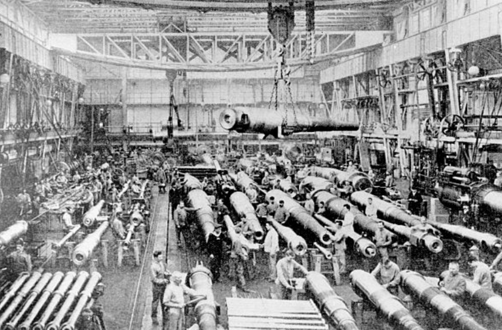
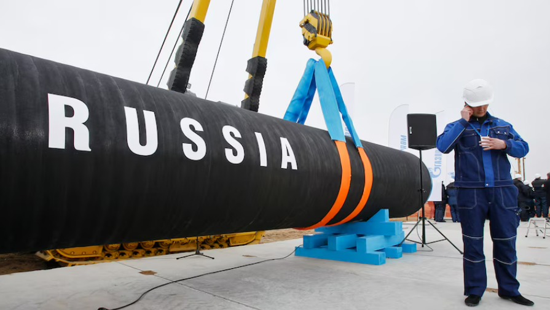
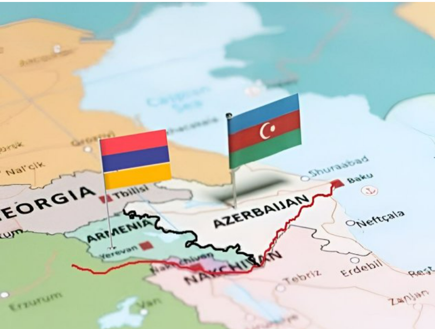
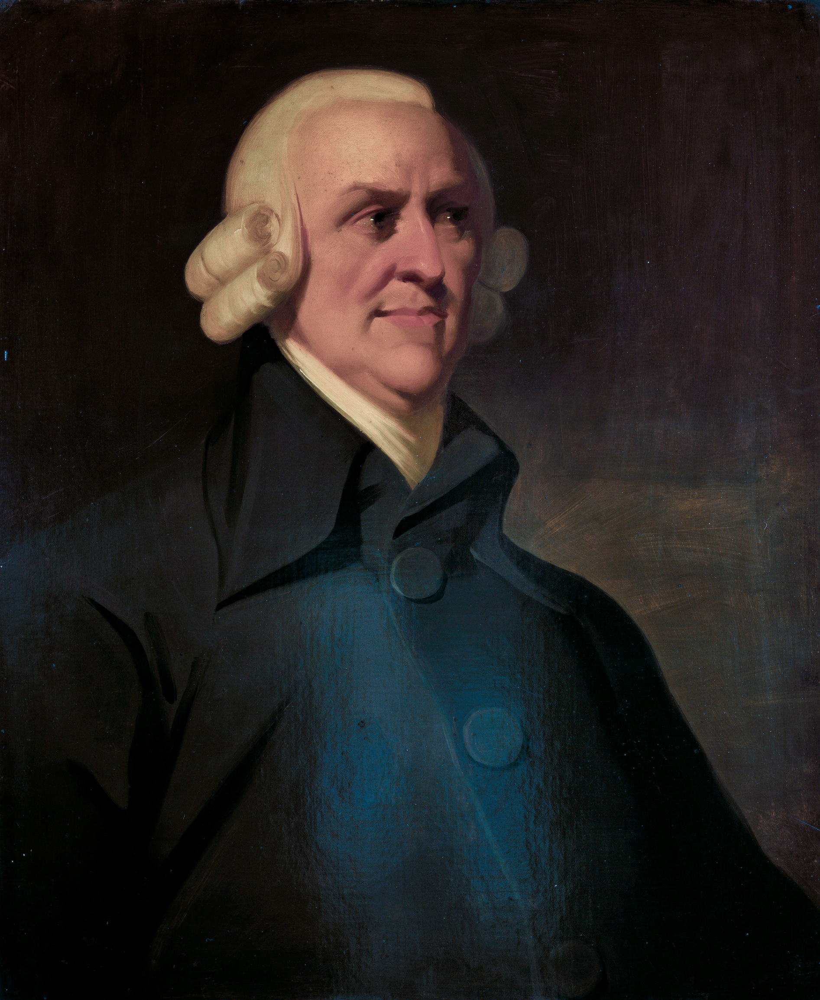
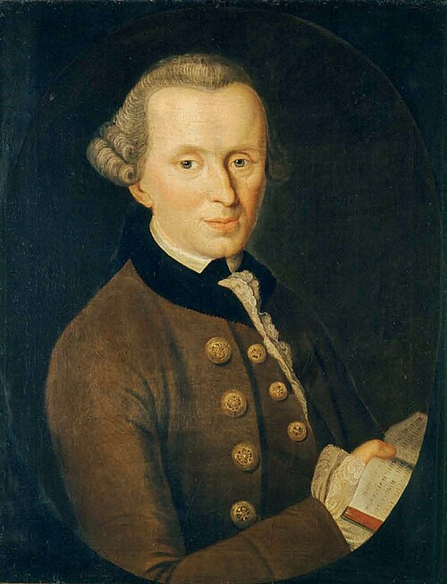
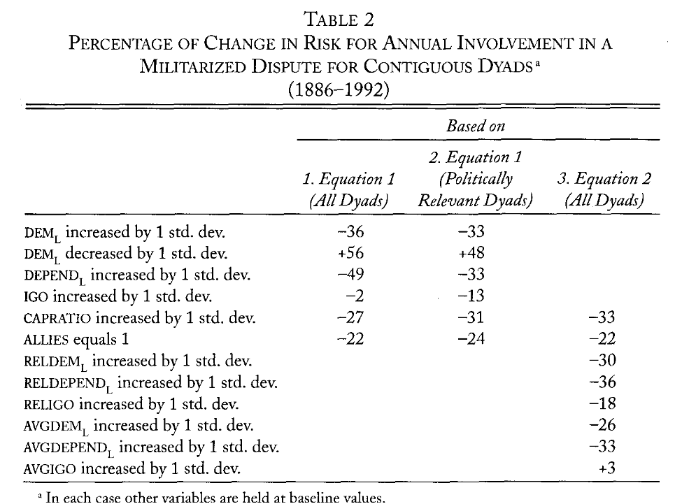

## Today

- The relationship between trade and international conflict
- What is the role of institutions?
- What strategic considerations matter?

## Trade and international conflict

Does [trade]{.alert} between countries increase or decrease the likelihood that they will wage [war]{.alert} on each other?

::::{.columns}
::: {.column width="33%"}

:::
::: {.column width="33%"}

:::
::: {.column width="33%"}

:::
::::

This is a classic question in international relations

## Trade and war: classic approaches 

::::{.columns}
::: {.column width="50%"}

### Liberalism

{width="30%" fig-align="center"}

::: {.nonincremental}
- Free trade is a ["positive-sum"]{.hover-note data-tooltip="This means that all parties can derive a net benefit from trade. In constrast, zero-sum means that total benefits are zero, so someone's gains must be someone else's losses."} game which makes all parties involved better off

- Trade interdependence generates common economic interests harmed by conflict
:::

$\implies$ Trade decreases conflict

:::
::: {.column width="50%"}

### Realism

{width="30%" fig-align="center"}

:::{.nonincremental}
-  The world system is anarchic, states have security concerns arising from mutual threats

- Trade interdependence increases mutual threats (that trade will be eventually cut)
:::

$\implies$ Trade increases conflict

:::
::::

## Do democratic institutions matter?

### The Kantian peace

{width="50%" fig-align="center"}

- Philosopher Immanuel Kant suggested that "republican constitutions", a "commercial spirit", and a federation of interdependent republics would lead to perpetual peace
- Recently, political scientists have highlighted a [democratic peace]{.alert}, by which democracies are unlikely to attack each other
- Note that this is an argument based on empirical observations
- But is democracy a cause or just happens to coincide with other global trends (e.g., the rise of hegemonic powers)?

# Examining the Kantian peace {.section}

## Argument and Hypothesis

Oneal and Russett (1999) examine empirically the soundness of the "Kantian peace" argument

- **Hypotheses**: 
  1. Democracies will use military force less frequently, especially against other democracies 
  2. Economically important trade creates incentives to maintain peaceful relations 
  3. Intergovernmental organizations (IGOs) constrain decision-makers and promote peace 
- Incorporate the realist assumption that power matters and states pursue it, but with the perspective that institutions constrain single actors
- This framework allows for both theories' predictions to hold in some cases

## Data and Methods

- **Units**: $\approx$ 6,000 pairs of states (dyads) observed annually between 1885 and 1992 $\rightarrow$ $\approx$ 150,000 observations (excluding WW years)
- **Outcome**: Annual dyadic involvement in Militarized Interstate Disputes (MIDs) from Correlates of War (COW) data
- **Independent variables**: democracy score and bilateral trade-to-GDP ratio of the country with the lowest score in the pair ($\rightarrow$ "weak link" assumption), shared IGO membership 
- **Controls**: Accounts for "realist" variables $\rightarrow$ capability ratio, alliances, geographic distance, contiguity, major power status
- **Methods**: Logistic regression estimated using the general estimating equation (GEE) method to adjust for temporal dependence.

## Results

::::{.columns}
::: {.column width="40%"}

:::
::: {.column width="60%"}
- Democracy and economic interdependence associated with lower likelihood of militarized conflict
- The association with shared IGO memberships is among "politically relevant" dyads (i.e., contiguous states or containing major powers)
- "Realist" factors such as power imbalance and geographic distance are associated with disputes
- Still, growing "Kantian" infuences probably account for more of the relative peace experienced in recent years
- Plausibly by constraining power politics over the last century
:::
::::

# Dynamic strategic considerations {.section}

## A theory of trade expectations 

Copeland (1996) argues that Liberalism and Realism present a puzzle regarding the largest conflicts of human history (e.g., the World Wars)

- Wars erupted between world powers that were highly interdependent...
- ...but decades of prior trade had not led to war
- How to reconcile these facts?

. . . 

Proposal: bring in a theory of trade [expectations]{.alert} that bridges the two perspectives

- The classic theories are *static*: they focus on countries' calculations in the [present]{.alert}
- A *dynamic* approach includes expectations about [future]{.alert} trade 
- Incorporates liberal insights (benefits of trade $\implies$ peace) and realist concern (vulnerability to trade break $\implies$ war)

## Argument and methods

**Argument**: The impact of interdependence on the probability of war depends on leaders' expectations of future trade

- High interdependence promotes peace when states expect trade levels to remain high in the future
- If dependent states expect access to trade to be cut, they are more likely to initiate war to secure access to goods and markets

 . . . 

**Methods**: Qualitative case studies from history: Germany before World War I (1890-1914) and before World War II (1930s-1939)

- **Case selection**: wars between world powers $\rightarrow$ avoid "overdetermined" aggressions of small nations
- **Data**: internal German documents reconstructing the decision-making process of elites
  - Diplomatic communications, war councils, etc.

## World War I

.jpg){width="50%" fig-align="center"}

Germany had unprecedently high trade levels prior to 1914 but its leaders had pessimistic expectations

- Strong British, French, and Russian protectionist policies aimed at curbing German influence
- These adversaries' global empires allowed them to sustain these strategies
- The country was becoming increasingly dependent on imports for food and sustaining the economy

. . . 

The "September program" plan states that "the general aim of the war" was the "security for the German Reich in west and east" and the will to reduce adversaries to economic dependence from Germany $\rightarrow$ economic hegemony over Europe

## World War II 

(2).jpg){width="40%" fig-align="center"}

Despite the state ideology of racial domination and its leader's personality, the core economic motivations of the regime were unchanged. Hitler and the military leadership viewed war for territorial expansion as a rational necessity for long-term survival

- Supply of food and raw materials for the industry behind the concept of *lebensraum*
- Invasion of Soviet Union would have secured long-term access to resources and cut the main future threat for Germany

## Implications

Are there implications for today?

> Russia still has significant economic ties with the states of the former Soviet Union, and is, in particular, dependent on pipelines through Ukraine and Belarus to sell its natural gas to Western European customers. These states in turn depend on Russia for their energy supplies. Should Ukraine use threats to turn off the pipelines as political leverage, low expectations for future trade might push Russia to reoccupy its former possession in order to mitigate its economic vulnerability
>
> [Copeland (1996), p. 40]

- The argument also implies that economic sanctions can potentially increase the likelihood of conflict
- For example, tariffs on China could increase its aggressivity towards neighbors in the Pacific

## Implications

- Are you convinced by the argument?
- Do you think that either (i) trade and war are substitutes or (ii) war is always instrumental to more trade?

## Next

- Trade and civil conflict
- Trade and ethnic conflict