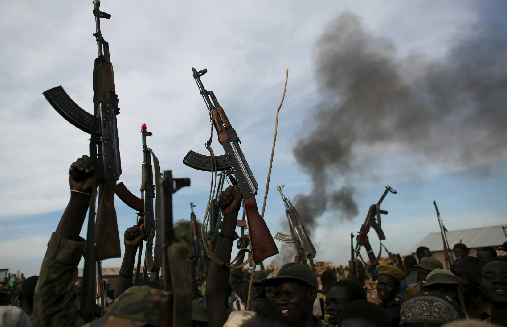
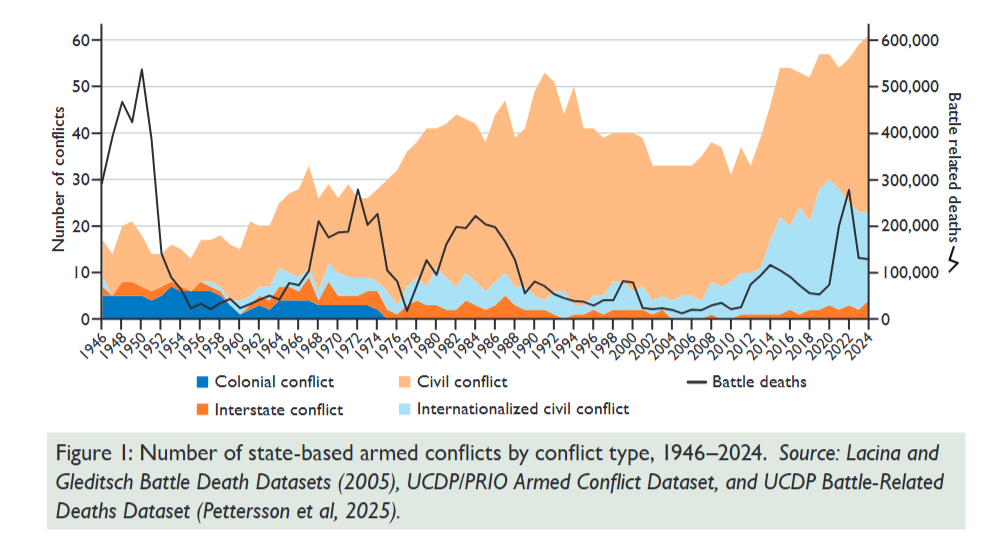
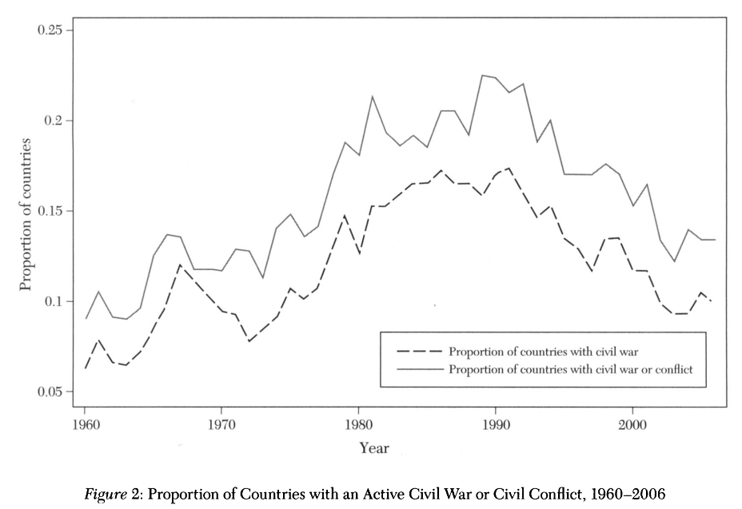
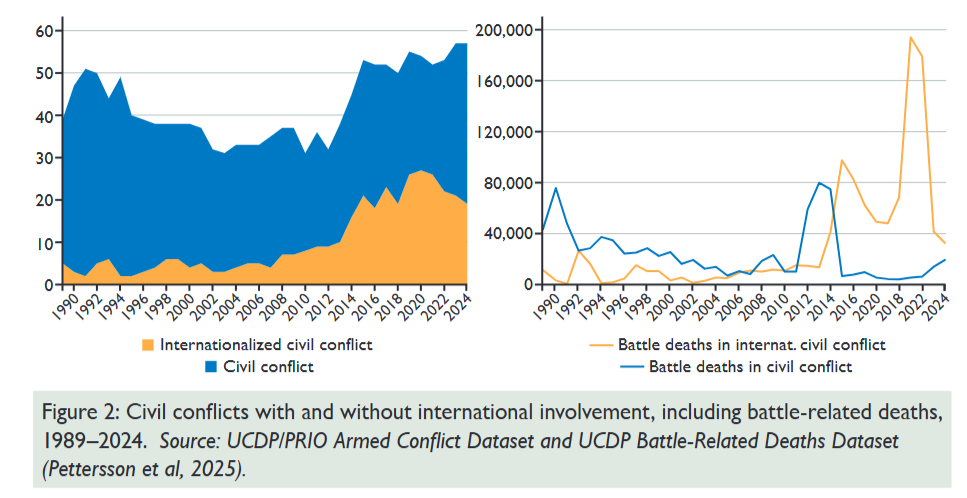
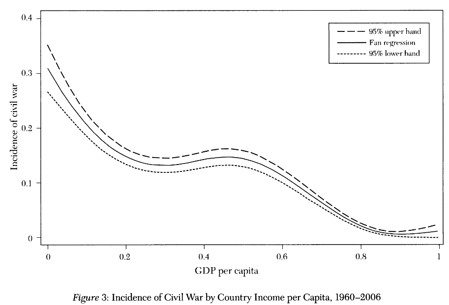
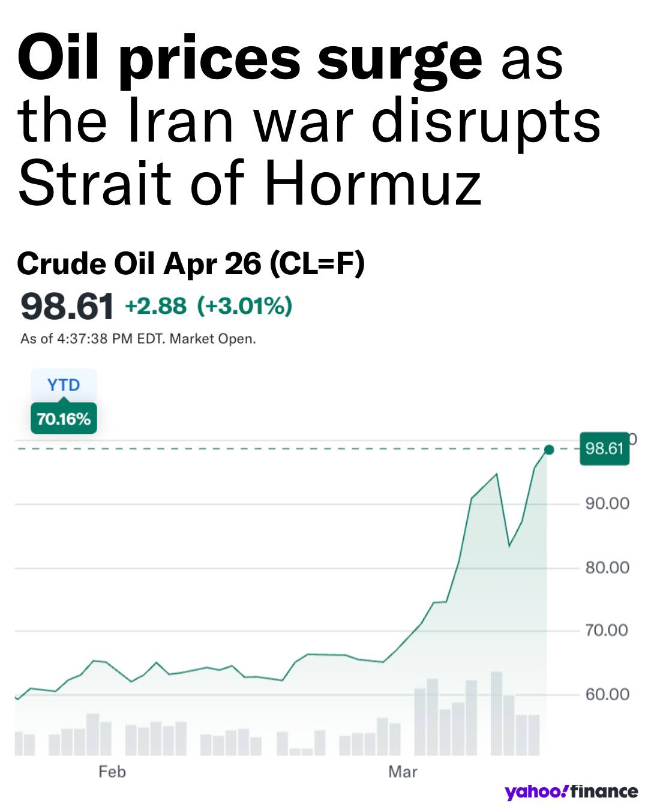
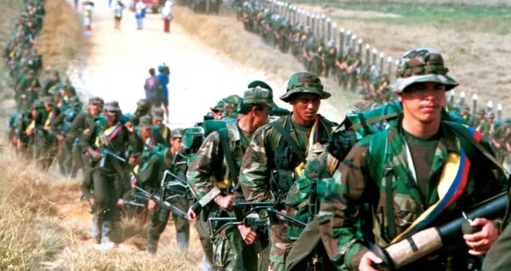
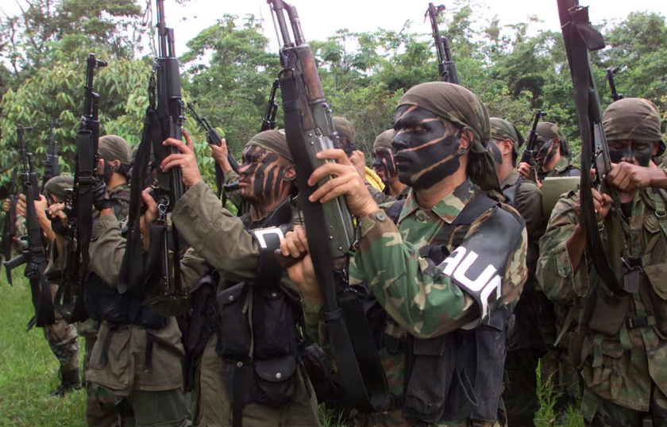
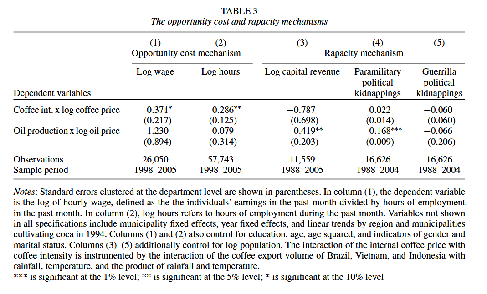
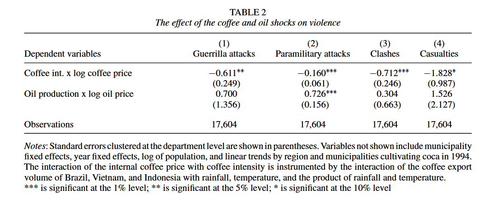

# Research design {.section}

## Guidelines

**What it should be**: An original research design for a hypothetical project in any area of IPE

- It is an **individual** assignment
- You will **not** have to actually do the research
- You should develop a research question in IPE and propose a way to answer it
    - It can be motivated by policy relevance or scientific interest
    - It can be based on any of the topics covered in the class or others (as long as it is IPE)
- You should propose a sound and realistic research project
    - That is, it should be reasonably be feasible with data and instruments within reach
    - E.g., "I will run a survey in country X" is fine, "I will develop a new vaccine" is not fine
- Submission [deadline]{.alert}: <u>April 24, 11.59</u> PM on Moodle as a <u>single PDF document</u>

## Format

**Strict format requirements**

- Max. 5 pages, 1.5 line spacing, font size 12
- References list does not count towards the page count
- You can use figures and data visualizations, although they are not strictly required

. . . 

**Structure**

- Research question (1 paragraph)
- Motivation (1 paragraph)
- Relevance of the research (1 paragraph)
- Specifics of the research design (rest of the document)
    - Population to be studied and why you chose to select it
    - What data are needed
    - Your proposed empirical strategy: assumptions needed (if any), challenges to causal inference (if any), strategies to address them (if any)

## Last week presentation session

In the last week of classes, we will have two presentation sessions

- Everyone will make a short presentation of the research design (max 10 minutes, with slides)
- We follow alphabetical order:
    - **Tuesday, April 28**: Judy, Alexander, Elizabeth, Lya, Logan, Jackson, Natalie
    - **Friday, May 1st**: Emmett, Alex, Ella, Nathan, Pratik, Rebeca, Saina

- The presentation is for practice and discussion but does not affect the final project grade
- Only the submitted PDF counts for the final project grade

# Trade and civil conflict {.section}

## Civil conflict

In our last class we have talked about international conflicts and wars

However, most armed conflicts in the world happen within country borders

{fig-align="center"}

. . . 

[Civil conflict]{.alert}: an armed conflict between two or more groups in the same country

## Civil conflict

- [Civil conflicts]{.alert} account for most of the [state-based conflicts]{.hover-note data-tooltip="A conflict due to contested incompatibility over government control (e.g., between the Government of Mali and Jama’at Nusrat al-Islamwal-Muslimin (JNIM)) and/or territory (e.g., between the Government of Israel and Hamas over Palestine), where the use of armed force between two parties results in at least 25 battle-related deaths in a calendar year. Battle-related deaths refers to fatalities directly caused by the warring parties. (PRIO, p.9)"} in the world at any given moment
- Note:  *conflict* $\rightarrow$ 25+ battle-related deaths in a year; *war* $\rightarrow$ 1000+

## Civil conflict

A large minority of countries has been affected by civil conflicts or wars in the post-WWII period

## Civil conflict

Civil conflicts increasingly escalate into international conflicts

## Economic conditions and civil conflict

::::{.columns}
::: {.column width="50%"}
- Across countries, civil conflict is consistently associated with poverty
- This suggests that as economic conditions improve, violence becomes less desirable $\rightarrow$ [opportunity cost]{.alert}
- On the other hand, more resources mean that there is more to appropriate through violence $\rightarrow$ ["rapacity"]{.alert}
- E.g., oil-producing countries tend to have more conflict
- **Theoretically**, both mechanisms are sound
- **Empirically**, economic shocks can have different effects depending on what mechanism they activate
:::
::: {.column width="50%"}

:::
::::

## Trade and civil conflict

::::{.columns}
::: {.column width="50%"}
How can trade matter for civil conflict?

- Countries' integration in the global economy exposes them to unexpected economic shocks
- Can be positive (e.g., higher prices for exported goods) or negative (e.g., higher prices for imported goods)
- Can alter power balance or opportunities for actors on the ground
- From a [research design]{.alert} perspective, trade shocks often provide exogenous changes to conditions for conflict
:::
::: {.column width="50%"}
{width="50%"}
:::
::::

# Empirical evidence: the Colombian conflict {.section}

## Background

Civil conflict started in 1964, after years of inter-partisan political violence and with the Cold War in the background

::::{.columns}
::: {.column width="50%"}
{width="70%" fig-align="center"}
:::
::: {.column width="50%"}
{width="70%" fig-align="center"}
:::
::::

- **Main actors**: Left-wing [guerrilla]{.alert} groups (esp. FARC and ELN); [paramilitary]{.alert} counter-insurgents, later forming a unified coalition (AUC); armed forces of the Colombian state
- Groups $\rightarrow$ political and economic motivations, recruit in parallel to labor market, and fund themselves through predation and illegal activities
- Government-FARC ceasefire deal (2016) and disarming, violence between the state and former FARC factions remains

## International shocks and conflict dynamics

Dube and Vargas (2013) use the unique features of Colombia to study the consequences of economic shocks on conflict

- Colombia is exposed to international markets in different sectors: [oil]{.alert} and [coffee]{.alert}
- Economic shocks to different sectors activate different economic mechanisms for conflict
- [Coffee]{.alert} is a labor-intensive sector: $\Uparrow$ prices $\implies$ $\Uparrow$ wages $\implies$ $\Downarrow$ labor supplied to conflict $\implies$ $\Downarrow$ violence
    - [Opportunity cost]{.alert} mechanism
- [Oil]{.alert} is a capital-intensive sector: $\Uparrow$ prices $\implies$ $\Uparrow$ contestable resources $\implies$ $\Uparrow$ violence
    - [Rapacity]{.alert} mechanism

## Data and design

- **Data**: Data recording over 21,000 conflict events (guerrilla attacks, paramilitary attacks, clashes, and casualties) in Colombian municipalities from 1988 to 2005 
- **Design**: 
    - Difference-in-differences empirical strategy interacting exogenous international commodity prices with the production intensity of those commodities in each municipality 
    - Instrumental variable for coffee prices and coffee intensity

## Main results

- Drops in international coffee prices lower wages and employment in coffee-cultivating municipalities 
- Increases in oil prices increases conflict in oil-producing municipalities  

## Main results

## Discussion

Questions?

## Next

- Trade and ethnic conflict

