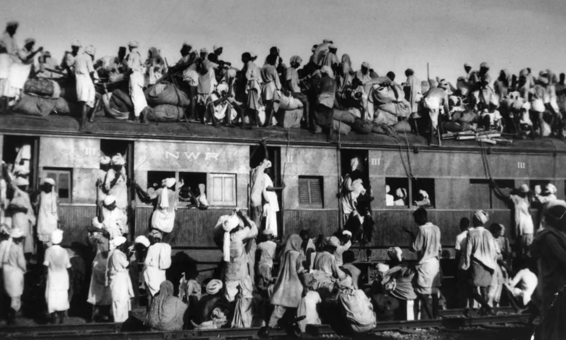
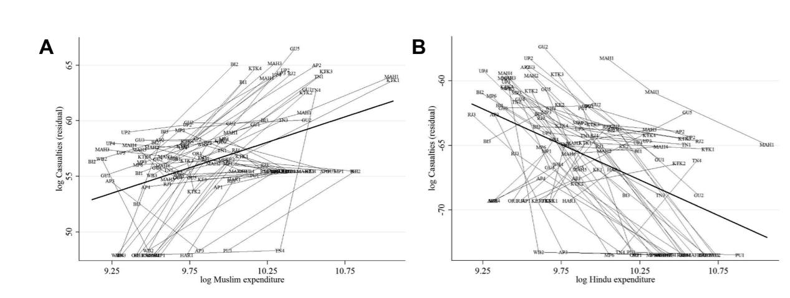
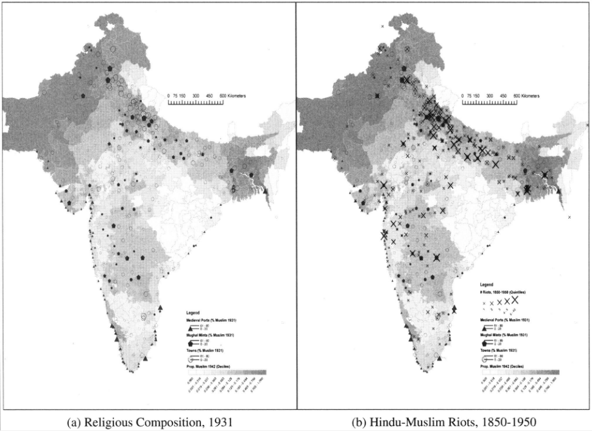
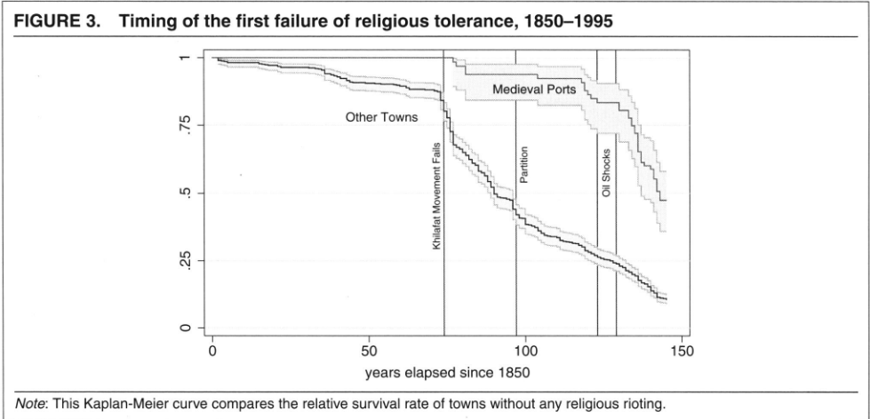
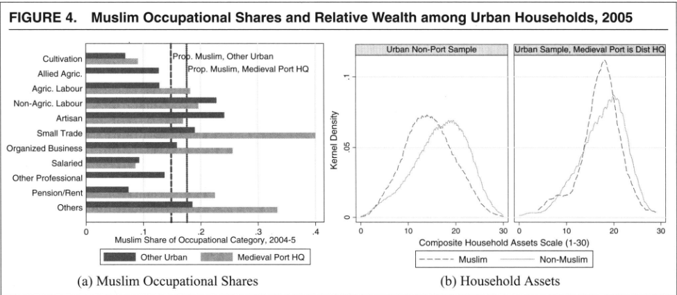

## Reminder

- Research design due **today** by 11.59 PM

## Today

- What happens when conflicts follow group identities?
- How can international trade shape ethnic conflict dynamics?

# Ethnicity and civil conflict: an overview {.section}

## Ethnicity

What is [ethnicity]{.alert}?

. . .

Ethnicity $\rightarrow$ a social category where eligibility for membership is given by [inherited]{.alert} traits

- Mother tongue, skin color, common ancestry, territorial origin, etc.

. . . 

Why is ethnicity relevant for political science?

- Political divisions (e.g., party systems) and violent conflicts often take place between different ethnic groups $\rightarrow$ ethnicity is politically relevant/politicized
- However, in much of the world ethnicity is not relevant $\rightarrow$ different groups intermarry, vote for the same parties, etc.

. . . 

$\implies$ The question is: why and how is ethnicity politically relevant? Why do we have ethnic conflict in some cases but not others?

## Views of ethnicity

::::{.columns}
::: {.column width="33%"}

### Primordialism

- Ethnic identities are fixed and immutable
- People inherit one ethnic identity from which they cannot escape
- Ethnic identities cannot be changed by social processes
- Ethnic groups are "given" ([exogenous]{.alert}) categories

:::
::: {.column width="33%"}

### Instrumentalism

- Ethnicities are defined by attributes
- People can possess attributes consistent with one or more ethnicities ("repertoires")
- People change/switch identity based on their rational goals
- Ethnic groups are [endogenous]{.alert} and constantly renegotiated
 

:::
::: {.column width="33%"}

### Constructivism

- Shares with instrumentalism the axioms of attributes and identity change
- But ethnicities are "sticky" and difficult to change in the short run
- Social and political processes change the salience of some categories and make them relevant
- Ethnic groups are [endogenous]{.alert} but can be seen as exogenous for an individual

:::
::::

. . . 

$\implies$ while [constructivism]{.alert} is the mainstream framework in political science, in practice people [behave]{.alert} as if ethnicities were [primordial]{.alert}

## Politicization of ethnicity

Politicized ethnicity $\implies$ ethnic [cleavages]{.alert}

. . . 

What makes ethnicity relevant/politicized?

- Shared cultural traits make collective action easier 
    - People are embedded in coethnic networks
    - People have social norms of reciprocity towards their coethnics
    - Coethnics may have correlated political preferences

- People tend to behave differently with members of their group 
    - When distribution is involved, more generosity towards ingroup members (from social psychology)
    - Ethnicity is relatively visible, making it easier to include or exclude

. . . 

$\implies$ Ethnicity is a natural focal point for building coalitions, gathering political support, and distributing resources

## Institutions and the politicization of ethnicity

These accounts are theoretically sound in a general way. However, in the real world people adapt to the external incentives

. . . 

$\implies$ constructivist scholars study how [institutions]{.alert} determine the incentives of elites and social actors to shape identities

. . . 

::: {.callout-note title="Institutions"}
Systems of norms, beliefs, and organizations that determine the "rules of the game"
:::

. . . 

- Different institutions $\implies$ different incentives to organize society along ethnic lines
- **Ethnic demography** makes a group more important than others for building a majority $\implies$ affect group's political mobilization
- **Electoral rules** (e.g., majoritarian vs proportional representation) determine the cleavages that are politically represented
- **Weak states** where allocation of resources is more discretional (e.g., patronage) favor ethnicity as a mechanism to target distribution and exclude others

## Ethnic conflict

What are the causes of ethnic conflict?

. . . 

**Political mechanisms** $\rightarrow$ Why is civil conflict organized along ethnic lines?

. . . 

- Some theoretical mechanisms of politicization also reinforce the probability of conflict
- Different preferences + polarization $\implies$ [commitment problem]{.alert}
- Ethnic networks and norms make it easier to mobilize and distribute spoils
- Intergroup violence increases identity salience $\implies$ future power for ethnic leaders

. . . 

**Economic mechanisms** $\rightarrow$ Do economic conditions matter for ethnic conflict? 

. . . 

- Intergroup inequality $\rightarrow$ associated with politicization, but mixed evidence on conflict
- Within-group inequality $\rightarrow$ possible because of complementarity between ethnic "capital" and ethnic "labor"
- Group average incomes $\rightarrow$ analogous considerations for civil conflict (opportunity cost)

# Economic changes and ethnic conflict {.section}

## Argument

Mitra and Ray (2014) study the relationship between group incomes and violence

. . . 

**Argument**

- Economic changes *within groups* are an important (and underexplored) source of intergroup violence
- "Two faces of economic fortune":
    - If a group is relatively poor, an increase in their income makes them a more lucrative target $\implies$ $\Uparrow$ violence *against* them
    - Recall the [rapacity]{.alert} effect
    - Conversely, an increase in a group's wealth $\implies$ $\Uparrow$ [opportunity cost]{.alert} of engaging in violence $\implies$ $\Downarrow$ violence *by* them
- $\implies$ a positive relationship between a group's income and subsequent violence against them implies that the rival group is the primary aggressor acting on economic considerations

## Case Study and Historical Background

Hindu-Muslim violence in post-Independence India

- Over 7,000 deaths between 1950 and 2000
- Muslim minority generally poorer than Hindu majority
- Documented instances where violence is used systematically for economic gain (e.g., Hindu merchants targeting Muslim rivals)

## Data and Methods

- **Outcome**: Episodes of Hindu-Muslim violence from Varshney and Wilkinson
- **Economic data**: National Sample Survey (NSS) data on per capita monthly expenditures for Hindus and Muslims 
- **Methods**: Regression, controlling for population, literacy, urbanization, within-group inequality, and political factors

## Main Results

::::{.columns}
::: {.column width="60%"}

:::
::: {.column width="40%"}
:::{.nonincremental}
- An increase in Muslim per capita expenditures is associated to an *increase* in religious conflict
- An increase in Hindu per capita expenditures has *negative*/no association with conflict
:::
:::
::::

## Discussion

- What are the implications for our understanding of ethnic conflict?
- What are the implications for prevention/reduction of ethnic conflict?
- Recall our presentation on Gaikwad and Suryanarayan: members of disadvantaged groups in India are more likely to support international trade integration
- How should we think about the consequences of trade integration in multiethnic societies?
- Do you think the link between economic conditions can lead to ethnic violence in any context? Does trade integration provide opportunities for cooperation?

# Trade: economics and institutions {.section}

## Institutions and conflict

- Recall that [institutions]{.alert} can influence whether identities become politically important
- They can also influence whether conflict erupts or not
- [In the same logic of international relations, institutions can make cooperation self-sustainable in the long run]{.remark}
- What are these institutions? And what makes them possible?
- Several formal political institutions: e.g., territorial autonomy, ethnic representation, consociationalism...
- Here, we will focus on those that emerge around [trade]{.alert}

## Trade, institutions, and ethnic tolerance

Jha (2013) studies the long historical legacies of medieval trade on Hindu-Muslim conflict in India

**Argument**

- Trade can foster peace in ethnically diverse societies if two conditions are met
    1. A nonreplicable, nonexpropriable source of interethnic complementarity
    2. A nonviolent mechanism to share the gains from trade
- These conditions are the basis for [institutions]{.alert} that make intergroup trust and cooperation sustainable over time

. . . 

$\implies$ Societies without these incentives (e.g., expropriable skills or intergroup competition) face a higher risk of ethnic conflict

. . . 

$\implies$ This mechanism counteracts the risk of violence due to "rapacity" against thriving minorities

## Historical background

- 13 centuries of Hindu-Muslim interaction in South Asia
- During 8th-17th centuries, coordination of markets through Hajj pilgrimage $\implies$ Muslim traders have advantage in Indian Ocean trade
- Ethnically mixed trading ports of Indian coast are the center of Muslim trade
- Impossible for Hindus to replicate Muslim trade networks $\implies$ interethnic [complementarity]{.alert}
- Competition between Muslims $\implies$ surplus of trade "shared" with Hindu co-locals (e.g., export of local products)
- Local institutions for interethnic cooperation are created in trading ports
- By contrast, in non-port mixed towns, Hindus and Muslims are often [competitors]{.alert} for access to economic resources and patronage

## Research design

- **Data**: data on towns from medieval to post-colonial history
- **Treatment**: the town was a medieval trading port
- **Outcome**: Hindu-Muslim riots between 1850 and 1950, and from 1950 to 1995
- **Instrument**: medieval natural harbors (coastal indentations) as instrument for medieval port locations

## Results

{fig-align="center"}

- Medieval port towns were five times less prone to Hindu-Muslim riots between 1850 and 1950 compared to otherwise similar towns

## Results

{fig-align="center"}

- A "legacy of peace" remains between 1950 and 1995 $\rightarrow$ lowers incidence of ethnic rioting by more than half
- Standard socio-economic variables fail to explain the pattern: medieval ports are on average poorer and more mixed (normally associated with *more* ethnic violence)

## Institutions as substitutes for state protection

{fig-align="center"}

- Muslims in medieval ports face less interethnic inequality

- The peace effect of medieval ports is strongest when state political incentives to protect minorities are weak $\implies$ local institutions can substitute for state protection

## Discussion

- What do you think?
- How should we think about the consequences of trade integration in multiethnic societies?

## Next

Presentations:

- **Tuesday, April 28**: Judy, Alexander, Elizabeth, Lya, Logan, Jackson, Natalie

- **Friday, May 1st**: Emmett, Alex, Ella, Nathan, Pratik, Rebeca, Saina